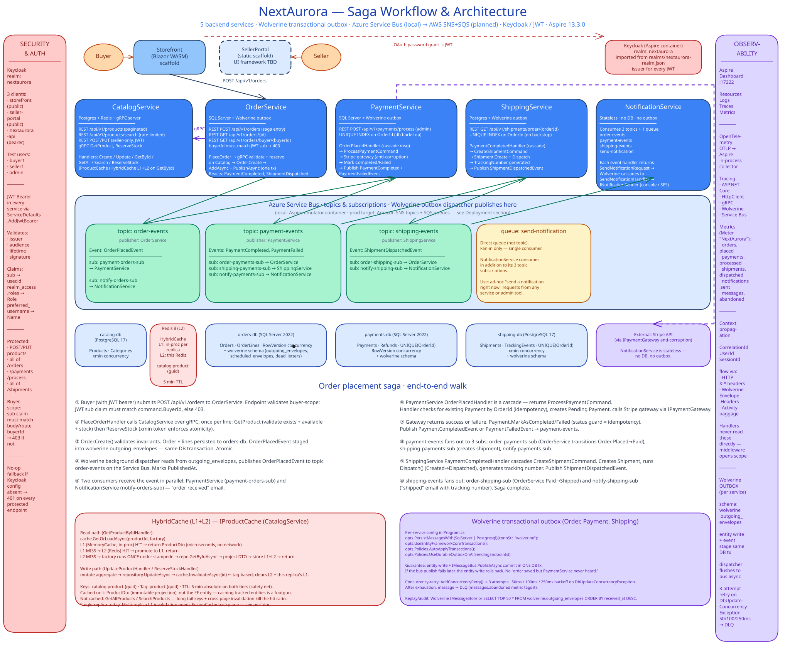
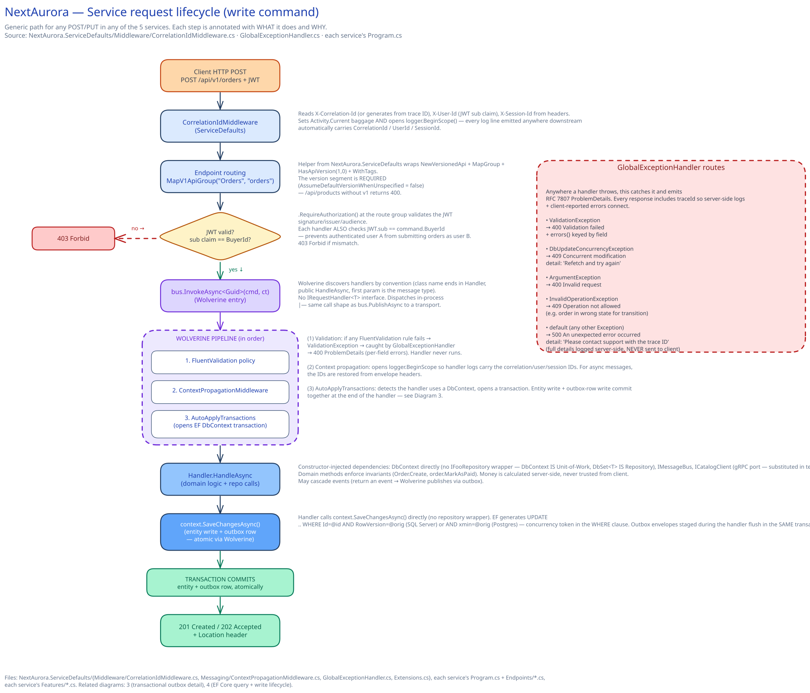
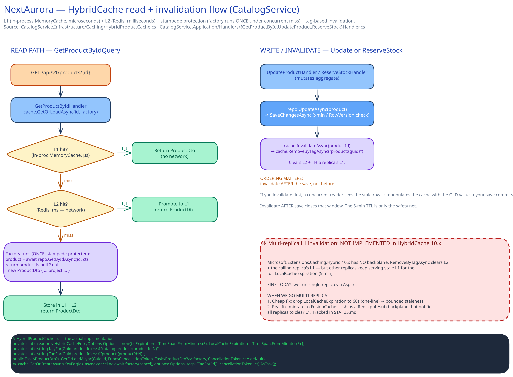
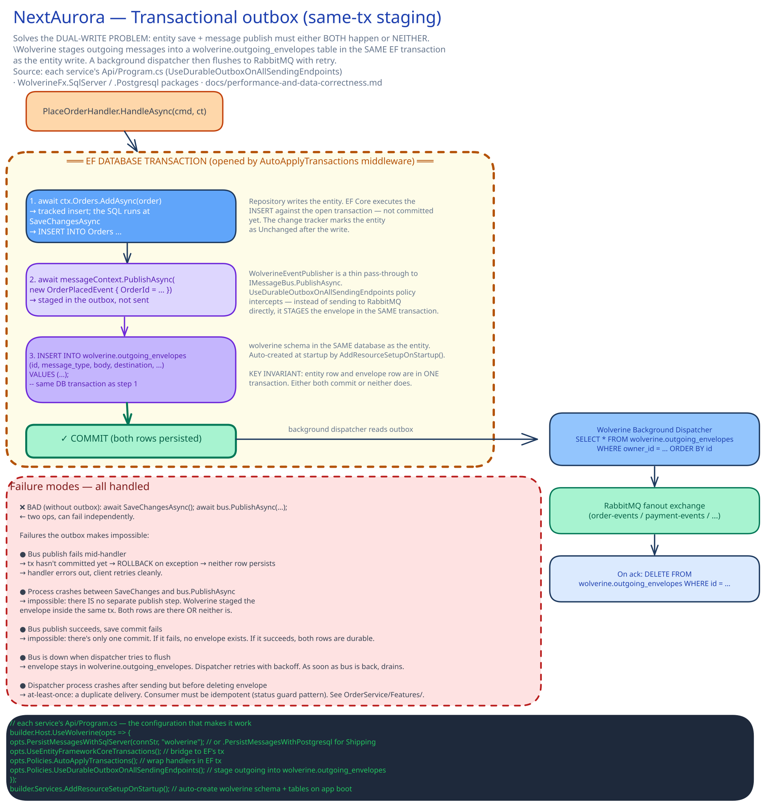
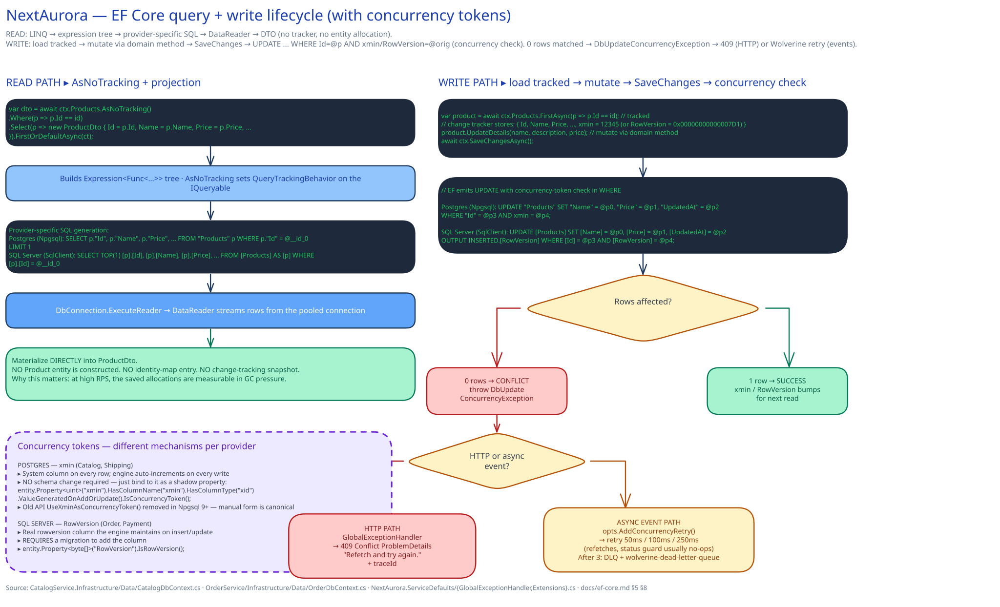
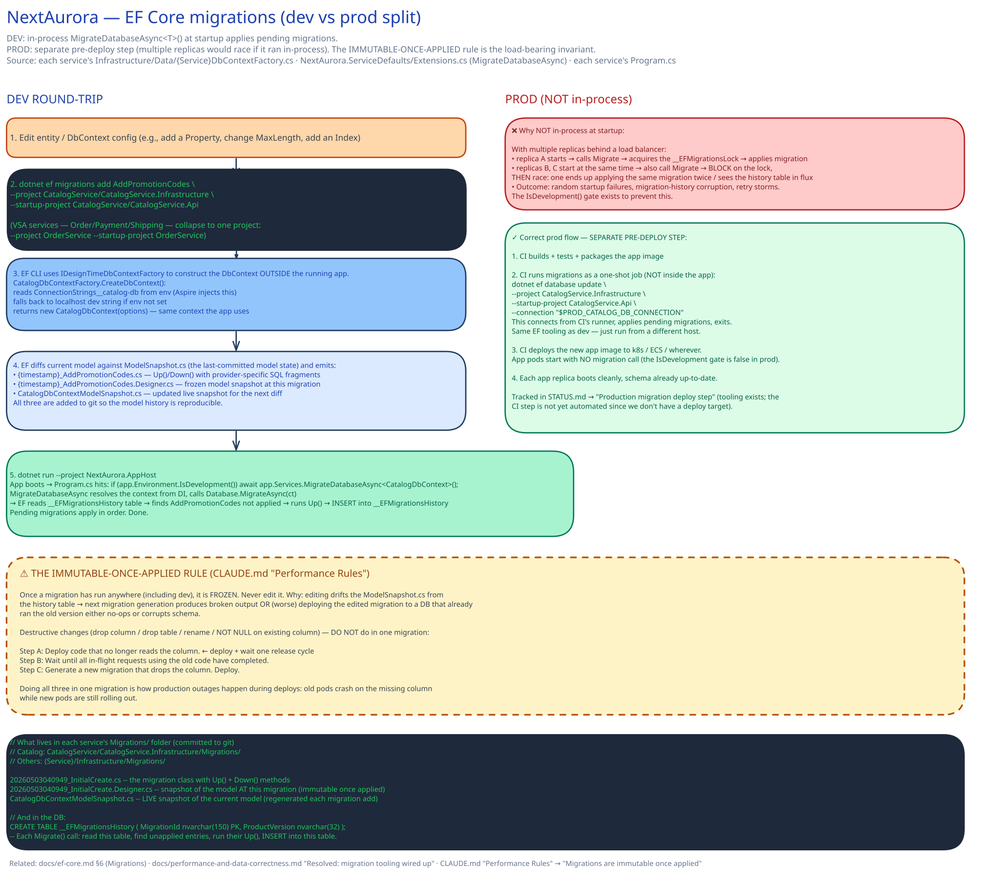

# NextAurora

[](https://github.com/emeraldleaf/NextAurora/actions/workflows/ci.yml)
[](https://github.com/emeraldleaf/NextAurora/actions/workflows/codeql.yml)
[](https://codecov.io/gh/emeraldleaf/NextAurora)

A microservices-based e-commerce platform built with .NET 10, Blazor, and .NET Aspire.

NextAurora demonstrates a production-style distributed system with event-driven architecture, CQRS, domain-driven design, and gRPC for inter-service communication.

> **Live demo:** [catalog-api-demo.fly.dev/scalar/v1](https://catalog-api-demo.fly.dev/scalar/v1) — CatalogService deployed to Fly.io with an interactive Scalar API explorer. Try `GET /api/v1/products` for the 7 seeded products. Auto-stops when idle, so the first request after a quiet period takes ~10s to wake the machine. *Scope: Catalog only — the full Order → Payment → Shipping → Notification saga runs locally via Aspire (see [Getting Started](#getting-started)).*

> **About this repo:**
> - **Monorepo, single architectural shape.** All five services use **Vertical Slice Architecture** — single Web SDK project, `Features/<UseCase>.cs` co-locating command/query + validator + handler, aggregates in `Domain/`. CatalogService originally used Clean Architecture (4 projects); it was collapsed to VSA in the [simplicity refactor](docs/STATUS.md) once the layer split stopped earning its keep at this scale. Handlers take `DbContext` directly — no `IFooRepository` wrappers — and integration tests with Testcontainers replace mocked-repository unit tests. See [CLAUDE.md "Project Structure"](CLAUDE.md#project-structure) for the promotion signal (5+ aggregates with cross-cutting rules → consider Clean). The original shape is preserved at the **[`v1-repository-pattern`](https://github.com/emeraldleaf/NextAurora/releases/tag/v1-repository-pattern)** tag — `git checkout v1-repository-pattern` browses a textbook EF Repository pattern across all 5 services for comparison.
> - **Two database engines on purpose.** **CatalogService** + **ShippingService** run on **PostgreSQL** (Npgsql); **OrderService** + **PaymentService** run on **SQL Server** (Microsoft.Data.SqlClient). NotificationService is stateless. The split exercises both EF Core providers and the per-provider primitives the architecture leans on: **Postgres `xmin`** (system column, no schema change) vs **SQL Server `rowversion`** (real column, requires migration) for optimistic-concurrency tokens; **Wolverine's `PersistMessagesWithPostgresql` vs `PersistMessagesWithSqlServer`** for the transactional outbox; **`DistributedLock.SqlServer` (`sp_getapplock`)** for the PaymentRecoveryJob sweeper.

> **How it was built — AI-assisted, multi-model review, verification at every layer.**
> - **Two AI reviewers, not one.** [Claude Code](https://claude.com/claude-code) (Opus 4.7) is the primary pair-programmer — reads [`CLAUDE.md`](CLAUDE.md), the project-specific [`.claude/skills/`](.claude/skills/) (e.g. the `dotnet-performance` skill loaded for EF Core review, `excalidraw-diagram` for architecture visuals), and a persistent project memory. **GitHub Copilot (GPT-5)** sits in-editor for second-opinion diff review, with project conventions encoded in [`.github/copilot-instructions.md`](.github/copilot-instructions.md). Disagreement between the two is treated as a signal to dig deeper, not pick the louder voice. The principle is not "AI wrote it" — it's *two models + a human author + automated checks all sign off before merge*. The working loop: implement → run unit + integration tests → cross-model review → fix → commit.
> - **Verification at every layer.** Build: `TreatWarningsAsErrors` + four build-time analyzers (Meziantou, SonarAnalyzer.CSharp, Roslynator, BannedApiAnalyzers — the last rejects concrete concurrency hazards at compile). Tests: 134 unit + integration slices via [Testcontainers](https://dotnet.testcontainers.org/) (real Postgres + Redis for Catalog; real SQL Server + stubbed Wolverine transport for Order). CI: GitHub Actions runs build + tests + Coverlet/Cobertura coverage on every PR. Security: CodeQL on every push + weekly schedule. Dependencies: Dependabot weekly NuGet bumps (grouped per ecosystem). Local dev: Aspire orchestrates Postgres / SQL Server / Service Bus emulator / Redis / Keycloak in Docker so integration issues surface *before* push.
> - **Testing strategy was decided upfront, not retrofitted.** Unit tests cover handlers + domain rules with mocked infrastructure (NSubstitute, FakeTimeProvider). Integration tests use live containers to prove what mocks can't: EF migrations apply cleanly to fresh DBs, HybridCache actually invalidates on write, the `xmin` / `RowVersion` concurrency tokens actually fire under racing writes, Wolverine's transactional outbox + saga handlers actually persist and dispatch. Cross-service E2E over a live Azure Service Bus wire is tracked as deferred in [STATUS.md](docs/STATUS.md). Open issues and other deferred cleanups live there too.

[](docs/nextaurora-architecture.svg)

*Full system in one view — services, Service Bus topology, databases, and the 10-step order-placement saga. Click to view full-size.*

**Drill down into specific subsystems:** [service request lifecycle](#service-request-lifecycle) · [HybridCache flow](#hybridcache-flow) · [transactional outbox](#transactional-outbox) · [EF Core read and write](#ef-core-read-and-write) · [EF Core migrations](#ef-core-migrations) — all six diagrams in the [Reference diagrams](#reference-diagrams) section below.

## Architecture Overview

```
+-----------------------------------------------------+
|                   FRONTEND LAYER                     |
|                                                      |
|   Storefront            SellerPortal                 |
|   (Blazor WASM)         (scaffold)              |
+-------+--------------------+-------------------------+
        |  REST              |  REST
        v                    v
+-----------------------------------------------------+
|                    API LAYER                          |
|                                                      |
|  +--------------+    +---------------+               |
|  | CatalogSvc   |<---| OrderSvc      |               |
|  | (PostgreSQL)  |gRPC| (SQL Server)  |               |
|  +--------------+    +------+--------+               |
|                             |                        |
|  +--------------+    +------+--------+    +--------+ |
|  | PaymentSvc   |    | ShippingSvc   |    |Notif-  | |
|  | (SQL Server)  |    | (PostgreSQL)  |    |ication | |
|  +--------------+    +---------------+    |Svc     | |
|                                           +--------+ |
+-----------------------------------------------------+
        |                |               |
        v                v               v
+-----------------------------------------------------+
|                 MESSAGING LAYER                      |
|                                                      |
|   Async Messaging (Topics & Subscriptions)          |
|   Local/CI: Azure Service Bus emulator              |
|   AWS prod: Amazon SNS + SQS                        |
|                                                      |
|   Topics:                                            |
|   order-events -----> PaymentSvc, NotificationSvc    |
|   payment-events ---> OrderSvc, ShippingSvc,         |
|                       NotificationSvc                |
|   shipping-events --> OrderSvc, NotificationSvc      |
|                                                      |
|   Queue:                                             |
|   send-notification -> NotificationSvc               |
+-----------------------------------------------------+
        |                |               |
        v                v               v
+-----------------------------------------------------+
|                INFRASTRUCTURE LAYER                  |
|                                                      |
|  PostgreSQL    SQL Server    Redis    App Insights    |
|  (catalog,     (orders,     (cache)  (telemetry)     |
|   shipping)     payments)                            |
+-----------------------------------------------------+

Orchestrated by .NET Aspire (service discovery, health checks, OpenTelemetry)
```

## Services

| Service | Database | Purpose |
|---------|----------|---------|
| **CatalogService** | PostgreSQL | Product catalog, categories, search |
| **OrderService** | SQL Server | Order placement, lifecycle management |
| **PaymentService** | SQL Server | Payment processing (Stripe integration) |
| **ShippingService** | PostgreSQL | Shipment creation, tracking |
| **NotificationService** | Stateless | Email notifications (order confirmations, shipping updates) |
| **Storefront** | - | Customer-facing Blazor WASM SPA (scaffold) |
| **SellerPortal** | - | Merchant dashboard (scaffold — currently a static-file ASP.NET Core host, no UI framework chosen) |

## Tech Stack

- **.NET 10** / C# 13
- **ASP.NET Core** Minimal APIs
- **Blazor WebAssembly** (Storefront, scaffolded — no business logic yet)
- **ASP.NET Core static-file host** (SellerPortal scaffold — no UI framework chosen yet, currently serves a placeholder `index.html`)
- **Entity Framework Core 10** (PostgreSQL + SQL Server) with EF migrations
- **Azure Service Bus** for async event-driven messaging
- **Wolverine** for command/query dispatch, message handling, and the transactional outbox
- **gRPC** for synchronous inter-service communication
- **Keycloak + JWT Bearer** for authentication and authorization
- **Asp.Versioning** for URL-segment API versioning (`/api/v1/...`)
- **.NET Aspire** for orchestration, service discovery, and observability
- **OpenTelemetry** for distributed tracing, metrics, and logging
- **HybridCache** (.NET 10) for two-tier read caching — in-process MemoryCache (L1) + **Redis** (L2), with stampede protection and tag-based invalidation

## Prerequisites

- [.NET 10 SDK](https://dotnet.microsoft.com/download)
- [Docker Desktop](https://www.docker.com/products/docker-desktop/) — running, not just installed (Aspire spins up Postgres/SQL Server/Service Bus emulator/Keycloak/Redis as containers)
- [Aspire CLI](https://learn.microsoft.com/en-us/dotnet/aspire/)
- **ASP.NET Core dev certificate** — required by the Aspire dashboard's HTTPS endpoint. One-time per machine:

```bash
dotnet tool install --global aspire.cli
dotnet dev-certs https
dotnet dev-certs https --trust   # prompts for keychain password on macOS
```

> **Gotcha:** if `dotnet dev-certs` prints *"HTTPS development certificate operations are disabled in this environment. Your application will run on HTTP for local development."*, the env var `DOTNET_GENERATE_ASPNET_CERTIFICATE=false` is set somewhere in your shell init (commonly `~/.zshrc`). Find and remove it: `grep -rn "DOTNET_GENERATE_ASPNET_CERTIFICATE" ~/.zshrc ~/.zprofile ~/.zshenv ~/.bashrc ~/.bash_profile ~/.profile`, delete the matching line, open a fresh terminal, then re-run the dev-certs commands.

## Getting Started

1. **Clone the repository**

```bash
git clone <repo-url>
cd NextAurora
```

2. **Restore dependencies**

```bash
dotnet restore
```

3. **Run with Aspire**

```bash
dotnet run --project NextAurora.AppHost
```

This starts all services, databases (PostgreSQL, SQL Server), Redis, and Azure Service Bus emulator in Docker containers. The Aspire dashboard opens automatically showing all services, health status, logs, and distributed traces.

4. **Access the applications**

| Application | URL |
|-------------|-----|
| Aspire Dashboard | https://localhost:17225 |
| Storefront | Shown in Aspire Dashboard |
| SellerPortal | Shown in Aspire Dashboard |
| CatalogService API | Shown in Aspire Dashboard |
| OrderService API | Shown in Aspire Dashboard |

5. **Verify it's working** — once every resource in the Aspire dashboard reaches `Running` (first boot is slow; SQL Server + Service Bus emulator take 60–90s to be healthy on cold runs):

   - Click `catalog-service` in the Resources tab and open its `/scalar/v1` URL
   - Run `GET /api/v1/products` — you should see 7 seeded products
   - For the full saga walk (auth → place order → payment → ship → notify): see [scripts/smoke-test.sh](scripts/smoke-test.sh)

## API Endpoints

🔒 = requires JWT Bearer authentication. Pagination params apply to list endpoints (`?page=1&pageSize=50`, server cap 100).

**API versioning:** URL-segment versioning via `Asp.Versioning.Http`. The version is required in the route — `/api/v1/...`. Default version is `1.0`; unversioned URLs (`/api/products`) return 400. Versioned endpoints appear in OpenAPI under group `v1`.

### Catalog Service
- `GET /api/v1/products?page=&pageSize=` - List products (paginated)
- `GET /api/v1/products/{id}` - Get product by ID
- `GET /api/v1/products/search?query=&page=&pageSize=` - Search products (rate-limited, paginated)
- 🔒 `POST /api/v1/products` - Create a product
- 🔒 `PUT /api/v1/products/{id}` - Update a product

### Order Service (entire group 🔒)
- 🔒 `POST /api/v1/orders` - Place an order (buyerId in command must match JWT `sub`)
- 🔒 `GET /api/v1/orders/{id}` - Get order by ID
- 🔒 `GET /api/v1/orders/buyer/{buyerId}?page=&pageSize=` - Get orders by buyer (paginated; route buyerId must match JWT `sub`)

### Payment Service
- 🔒 `POST /api/v1/payments/process` - Process a payment (rate-limited)

### Shipping Service (entire group 🔒)
- 🔒 `GET /api/v1/shipments/order/{orderId}` - Get shipment by order ID

## Project Structure

```
NextAurora/
  NextAurora.AppHost/          # Aspire orchestrator
  NextAurora.ServiceDefaults/  # Shared OpenTelemetry, health checks, resilience
  NextAurora.Contracts/        # Shared events, commands, DTOs
  CatalogService/             # VSA — largest service (2 aggregates, gRPC server, HybridCache)
    Features/                     # GetProductById.cs, UpdateProduct.cs, ReserveStock.cs, etc.
    Domain/                       # Product, Category aggregates; IProductCache port
    Infrastructure/               # EF Core (Postgres + Migrations), HybridProductCache, DI
    Endpoints/                    # Minimal-API HTTP surface
    Grpc/                         # gRPC server (CatalogGrpcService — the peer for OrderService's client)
    Protos/catalog.proto          # Shared proto contract
    Program.cs                    # Composition root
  OrderService/               # VSA
    Features/                     # One file per use case: PlaceOrder.cs, GetOrderById.cs, saga handlers
    Domain/                       # Order aggregate, OrderLine, ports
    Infrastructure/               # EF Core (Data/ + Migrations/), gRPC client to Catalog
    Endpoints/
    Program.cs
  PaymentService/             # VSA
    Features/                     # ProcessPayment.cs (command + validator + handler), OrderPlacedHandler.cs
    Domain/                       # Payment aggregate, ports (incl. IPaymentGateway)
    Infrastructure/               # EF Core, Stripe ACL (Gateway/), Wolverine adapter, recovery job
    Endpoints/
    Program.cs
  ShippingService/            # VSA
    Features/                     # CreateShipment.cs, GetShipmentByOrder.cs, PaymentCompletedHandler.cs
    Domain/                       # Shipment aggregate, TrackingEvent, ports
    Infrastructure/               # EF Core, Wolverine adapter
    Endpoints/
    Program.cs
  NotificationService/        # VSA — smallest service, stateless
    Features/                     # SendNotification.cs (record + port + handler), NotificationEventHandlers.cs
    Infrastructure/               # ConsoleNotificationSender, DI
    Program.cs
  Storefront/                 # Blazor WASM customer app (scaffold)
  SellerPortal/               # ASP.NET Core static-file host scaffold (UI framework TBD)
```

**One shape across all five services.** Vertical Slice Architecture everywhere — features
are co-located by use case (`Features/<UseCase>.cs` containing command/query + validator +
handler), aggregates live in `Domain/`, and each service is a single Web SDK project.
CatalogService previously used Clean Architecture (4 projects) but was collapsed to VSA in
the simplicity refactor — at ~2k LOC and 2 aggregates the layer split wasn't earning its
keep, and one consistent shape is a stronger story than "we calibrate per service."
See [CLAUDE.md](CLAUDE.md#project-structure) "Project Structure" for the promotion signal
(when 5+ aggregates with cross-cutting domain rules emerge, consider Clean Architecture).

## Event Flow

The order lifecycle is fully automated through event-driven choreography:

```
Customer places order
  -> OrderService creates order (validates products via gRPC)
  -> Publishes OrderPlacedEvent

PaymentService receives OrderPlacedEvent
  -> Processes payment via Stripe gateway
  -> Publishes PaymentCompletedEvent (or PaymentFailedEvent)

OrderService receives PaymentCompletedEvent
  -> Marks order as Paid

ShippingService receives PaymentCompletedEvent
  -> Creates shipment, assigns carrier and tracking number
  -> Publishes ShipmentDispatchedEvent

OrderService receives ShipmentDispatchedEvent
  -> Marks order as Shipped

NotificationService receives OrderPlacedEvent
  -> Sends "Order Received" notification

NotificationService receives ShipmentDispatchedEvent
  -> Sends "Order Shipped" notification with tracking info
```

## Observability

Every request and Service Bus message carries three identifiers through the entire chain:

| Field | Source | Propagated Via |
|-------|--------|---------------|
| `CorrelationId` | `X-Correlation-Id` header (generated if absent) | Activity baggage → Service Bus `ApplicationProperties` |
| `UserId` | JWT `sub` claim | Activity baggage → Service Bus `ApplicationProperties` |
| `SessionId` | `X-Session-Id` header | Activity baggage → Service Bus `ApplicationProperties` |

These appear on **every structured log line** in every service, making it possible to search for a single `CorrelationId` and see the complete transaction timeline across all five services.

Key components:
- **`CorrelationIdMiddleware`** (`ServiceDefaults`) — HTTP entry point; extracts all three IDs from request headers and JWT claims
- **`ContextPropagationMiddleware`** — Wolverine middleware on the incoming side; restores the three IDs from envelope headers into the logger scope before each handler runs
- **`OutgoingContextMiddleware`** — Wolverine middleware on the outgoing side; stamps the three IDs onto outgoing message envelopes
- **`WolverineEventPublisher`** — thin pass-through to `IMessageBus.PublishAsync` so domain code stays infrastructure-agnostic

Order, Payment, and Shipping run **Wolverine's transactional outbox**: outgoing events persist to a `wolverine` schema in each service's database in the same DB transaction as the entity write, then dispatch to Service Bus via a background flush. See [`docs/context-propagation.md`](docs/context-propagation.md) and [`docs/performance-and-data-correctness.md`](docs/performance-and-data-correctness.md) for full details.

## Performance Testing

Two harnesses, both opt-in.

### Code-level micro-benchmarks (BenchmarkDotNet)

```bash
dotnet run -c Release --project benchmarks/NextAurora.Benchmarks
# Or filter to a single benchmark class:
dotnet run -c Release --project benchmarks/NextAurora.Benchmarks -- --filter '*OrderFactory*'
```

Always run in **Release** — Debug numbers are not representative. Currently includes `OrderFactoryBenchmarks` (Order aggregate creation with 1/5/25 line counts). Add new benchmarks under `benchmarks/NextAurora.Benchmarks/` following the same pattern.

### Endpoint load tests (k6)

```bash
brew install k6   # macOS; see https://k6.io/docs/getting-started/installation/ for others
# AppHost must be running. CATALOG_URL is the same value smoke-test.sh uses.
CATALOG_URL=https://localhost:XXXXX k6 run scripts/k6/smoke.js
```

Currently includes `smoke.js` (1 VU for 30s with p95 < 500ms / error rate < 1% thresholds). See [scripts/k6/README.md](scripts/k6/README.md).

## Code Quality

The project enforces code quality standards from day one:

- **Directory.Build.props** - Centralized build settings, `TreatWarningsAsErrors`, static analyzers (Meziantou, SonarAnalyzer, Roslynator)
- **Directory.Packages.props** - Central Package Management for consistent NuGet versions
- **.editorconfig** - Coding standards and naming conventions
- **GitHub Actions** - CI pipeline for build and test on every push/PR

## Authentication

JWT Bearer authentication is configured in `NextAurora.ServiceDefaults` and applied to every service. Identity is provided by **Keycloak**, which runs as an Aspire-managed container with the `nextaurora-realm` imported from `realms/nextaurora-realm.json`.

- **JWT validation** — issuer, audience, lifetime, and signing all validated via `AddJwtBearer` (`Authentication:Authority` config falls back to `Keycloak:Url`).
- **Claim mapping** — `preferred_username` is the name claim, `realm_access.roles` is the role claim.
- **Endpoint protection** — `.RequireAuthorization()` on every state-changing endpoint and the buyer-scoped read endpoints (Catalog write endpoints, all of `/api/v1/orders`, `/api/v1/payments/process`, all of `/api/v1/shipments`). Public read endpoints (`GET /api/v1/products`) remain anonymous.
- **Buyer-scope enforcement** — endpoints that operate on a buyer's data (e.g. `GET /api/v1/orders/buyer/{buyerId}`, `POST /api/v1/orders`) verify the JWT `sub` claim matches the route/body buyer ID and return 403 otherwise.

If Keycloak isn't configured (no `Authentication:Authority` and no `Keycloak:Url`), ServiceDefaults registers no-op auth services — `UseAuthentication` doesn't crash, but every `.RequireAuthorization()`-protected endpoint returns 401.

## Security & Validation

- **Input Validation** - FluentValidation validators on all commands, enforced via Wolverine's `UseFluentValidation()` pipeline policy (validators run before handlers; failures throw `ValidationException`)
- **Domain Invariants** - All entities enforce business rules in factory methods (guard clauses for invalid state)
- **Optimistic Concurrency** - `xmin` (Postgres) / `RowVersion` (SQL Server) tokens on every aggregate; `DbUpdateConcurrencyException` becomes 409 Conflict on the HTTP path and triggers Wolverine retry on the message path
- **Transactional Outbox** - Wolverine outbox in Order, Payment, Shipping; entity writes and event publishes commit atomically
- **Rate Limiting** - Fixed-window limiters on `/api/v1/products/search` (search) and `/api/v1/payments/process` (payments)
- **Global Exception Handling** - ProblemDetails responses with trace IDs; internal details never leaked to clients
- **Encapsulated Aggregates** - Collections exposed as `IReadOnlyList<T>` with private backing fields
- **HTTPS Redirection** - Enforced in production environments
- **Server-Side Pricing** - Order totals calculated from catalog data, not client-submitted prices
- **Pagination Caps** - List endpoints take `page`/`pageSize` (default 50, server-side max 100)

## Communication Patterns

| Pattern | Technology | Use Case |
|---------|-----------|----------|
| **Event-Driven (Async)** | Azure Service Bus | Order workflows, payment processing, shipping, notifications |
| **gRPC (Sync)** | Protocol Buffers | Product validation during order placement |
| **REST (External)** | ASP.NET Core Minimal APIs | Frontend-to-service communication |

### Wolverine handler discovery vs. DI registration — the trap to know

NextAurora uses [Wolverine](https://wolverinefx.net/) as the in-process dispatcher (commands, queries, event handlers). One subtlety surprises everyone the first time they write an integration test:

> **`opts.Discovery` is NOT `AddScoped`.** Wolverine builds its *own* internal handler-type map for `IMessageBus.InvokeAsync<T>()` dispatch — it constructs handlers itself via `IServiceScopeFactory` and never asks `IServiceCollection` for the handler type. So `serviceProvider.GetRequiredService<MyHandler>()` throws `InvalidOperationException: No service for type 'MyHandler' has been registered` *unless you also register the handler concretely.*

Production code is unaffected — endpoints go through `IMessageBus`:

```csharp
orders.MapGet("/{id:guid}", async (Guid id, IMessageBus bus, CancellationToken ct) =>
    await bus.InvokeAsync<OrderSummaryDto?>(new GetOrderByIdQuery(id), ct));
```

But **read-handler integration tests** typically skip the HTTP/auth layer and resolve the handler directly to assert the EF projection SQL. Those tests need an explicit registration:

```csharp
// OrderService/Infrastructure/DependencyInjection.cs
services.AddScoped<GetOrderByIdHandler>();
services.AddScoped<GetOrdersByBuyerHandler>();
```

`AddScoped<T>()` (single-type overload) registers the concrete type as both service-key and implementation — scoped lifetime, matches `DbContext`, no interface needed.

This is documented as a hard rule in [CLAUDE.md "Communication Patterns → Wolverine handler discovery is NOT DI registration"](CLAUDE.md), checked by CodeRabbit in [`.coderabbit.yaml`](.coderabbit.yaml) on every PR, and explained with the full mechanism in [docs/how-it-works.md "Two containers, not one"](docs/how-it-works.md).

## Documentation

| Guide | Description |
|-------|-------------|
| [How It Works](docs/how-it-works.md) | Developer walkthrough — VSA layout, CQRS via Wolverine, request lifecycle, outbox, event flow, testing |
| [Architecture](docs/architecture.md) | Service diagrams, communication matrix, domain model, design patterns |
| [Performance & Data Correctness](docs/performance-and-data-correctness.md) | Hard rules + decisions: AsNoTracking strategy, optimistic concurrency tokens, Wolverine outbox, HybridCache, Dapper escape hatch |
| [EF Core: Spec & Practice](docs/ef-core.md) | Reference guide: how we use EF Core, every decision + trade-off + code example, from concurrency tokens to the Dapper escape hatch |
| [Modern .NET 10 / C# 13 Features in Use](docs/dotnet-10-features.md) | Reference of the modern .NET features actively used in NextAurora — HybridCache, primary constructors, collection expressions, Asp.Versioning.Http, IExceptionHandler, Wolverine over MediatR+MassTransit, etc. Anchored in file:line. |
| [Project Decisions — API, Libraries, Architecture](docs/project-decisions.md) | Reference guide: cross-cutting decisions — Minimal APIs, URL versioning, Wolverine vs MediatR, HybridCache, Keycloak, observability, every library pick + alternative considered |
| [VSA vs. Clean Architecture](docs/vsa-vs-clean-architecture.md) | Portable decision guide (reusable across systems): the dependency rule vs the 4-project structure, the enforcement spectrum (convention → architecture tests → project split), how Testcontainers shifted the testing calculus, the duplication tradeoff, when to use which — NextAurora's VSA-everywhere choice as worked example |
| [Observability](docs/observability.md) | Correlation/user/session ID propagation, distributed tracing, Wolverine handler logging, DLQ handling, metrics |
| [Event Replay](docs/event-replay.md) | Wolverine outbox state, where to inspect outgoing/dead-letter envelopes, `IMessageStore` API |
| [Business Requirements](docs/BRD.md) | Functional requirements, implementation status, business processes, glossary |
| [Demo Deployment (recipe)](docs/demo-deployment.md) | One-time setup checklist for deploying CatalogService to Fly.io or AWS App Runner with Scalar exposed |
| [Demo Deployment (story)](docs/demo-deployment-story.md) | Narrative of what we actually did to deploy live at https://catalog-api-demo.fly.dev — decisions, gotchas, EF migration trade-offs |
| [Project Status](docs/STATUS.md) | Cross-session entry point — recently landed, next, open issues |

### Reference diagrams

Six diagrams break the system down — one concept per visual. Each is self-contained: title + numbered steps + side annotations explaining the *what* and *why*. Click any image for full-size. Editable `.excalidraw` sources live alongside each `.svg` in [`docs/`](docs/).

#### Full system architecture

5 services, Service Bus topology, databases, 10-step order-placement saga, cache + outbox callouts — embedded above in the overview.

#### Service request lifecycle

Generic write-command lifecycle — every step from HTTP POST → CorrelationIdMiddleware → versioned routing → auth + buyer-scope check → Wolverine pipeline (validation / context propagation / AutoApplyTransactions) → handler → SaveChanges → 201/202. Plus the GlobalExceptionHandler error-routing sidebar.

[](docs/service-request-flow.svg)

#### HybridCache flow

Catalog's cache flow: GetOrLoadAsync → L1 (μs) → L2 (ms) → factory (once under stampede) → store both tiers. Plus the write/invalidate path (`InvalidateAsync` ordering matters) and the multi-replica L1 caveat (HybridCache 10.x has no backplane).

[](docs/hybridcache-flow.svg)

#### Transactional outbox

The load-bearing reliability mechanism behind every cross-service event. Entity write + outbox-row write committed in ONE transaction (visual: dotted "TRANSACTION BOUNDARY" wrapping both). Background dispatcher → Service Bus → delete envelope. All failure modes spelled out.

[](docs/transactional-outbox.svg)

#### EF Core read and write

Side-by-side READ (LINQ → expression tree → provider SQL → DataReader → DTO, no tracker) and WRITE (load tracked → mutate → SaveChanges → UPDATE WHERE Id AND xmin/RowVersion → 0-rows branch → DbUpdateConcurrencyException → 409 or Wolverine retry). With Postgres `xmin` vs SQL Server `RowVersion` callout.

[](docs/efcore-query-write.svg)

#### EF Core migrations

Dev round-trip (`dotnet ef migrations add` → `IDesignTimeDbContextFactory` → snapshot diff → emitted classes → `MigrateDatabaseAsync` at startup) vs prod (separate CI pre-deploy step — *never* in-process at startup, because replicas race). Plus the immutable-once-applied rule with the multi-step destructive-change recipe.

[](docs/efcore-migrations.svg)

## License

[MIT](LICENSE) — Copyright (c) 2026 Joshua Dell. Free to use, modify, and redistribute with attribution.
