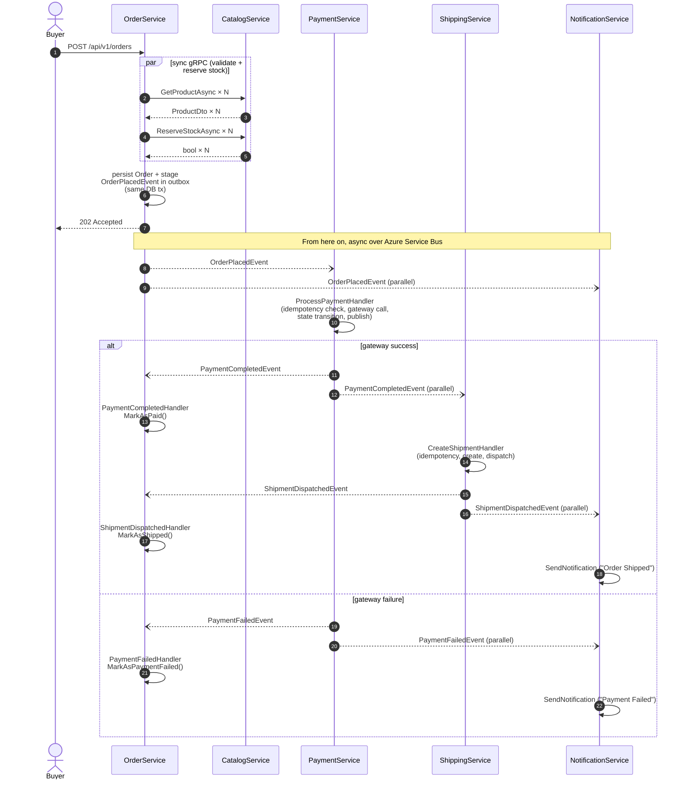

# Per-service code-flow walkthroughs

Five walkthroughs — one per microservice — that show **which files, classes, and interfaces get touched along the most-load-bearing request path** in each service. New contributors should read the walkthrough for whichever service they're about to touch before opening a file.

Each walkthrough is the same shape:
- Short intro framing the service's role + architecture style
- Mermaid `sequenceDiagram`(s) for the main flow(s), with lane labels = `ClassName file/path.cs`
- `stateDiagram-v2` if the service has a state machine
- `graph LR` showing structural relationships (CQRS split, DI wiring) when it adds clarity
- File inventory table
- Cross-references to neighbours

---

## The 5 services

| Service | Pattern | Role in the saga | Walkthrough |
|---|---|---|---|
| **OrderService** | VSA | Saga **entry point** + state owner (Order aggregate) | [orderservice.md](code-flows/orderservice.md) |
| **CatalogService** | Clean Architecture | Product catalog (read-heavy, cached); gRPC server for synchronous validation from Order | [catalogservice.md](code-flows/catalogservice.md) |
| **PaymentService** | VSA | Saga **middle** — charges via gateway + publishes outcome; recovery sweeper for stuck Pendings | [paymentservice.md](code-flows/paymentservice.md) |
| **ShippingService** | VSA | Saga **last** — creates & dispatches shipment; buyer-scoped read with IDOR protection | [shippingservice.md](code-flows/shippingservice.md) |
| **NotificationService** | VSA (minimal — no `Domain/`) | Stateless event-to-email pump (3 events in, email out) | [notificationservice.md](code-flows/notificationservice.md) |

---

## The saga at a glance — how the 5 services connect

Each walkthrough explains its own service in depth. This diagram is the glue — what events flow where, in time order.

The dashed (`--)`) arrows are over Service Bus; the solid arrows inside Phase 1 are synchronous HTTP/gRPC.

---

## Conventions across all 5 walkthroughs

**Lane labels in sequence diagrams** use `ClassName file/path.cs` so you can read a flow without checking a separate legend.

**Color coding inside `graph LR` blocks** (where used):
- Blue (`#dbeafe`) — write loaders / mutable state
- Green (`#a7f3d0`) — read projections / success endpoints
- Orange (`#fed7aa`) — start/trigger / infrastructure
- Purple (`#ddd6fe`) — caching layer

**Mermaid syntax gotcha** worth knowing if you edit these files: inside a `Note over X: <content>` block, no `;` or `:` allowed in the content — Mermaid uses both as parser delimiters. Use em-dash (`—`) or comma instead.

---

## See also

- [docs/architecture.md](architecture.md) — system-level architecture (Aspire, transport, polyglot persistence)
- [docs/cqrs-data-access.md](cqrs-data-access.md) — the read/write split rule that shapes each service's repository layer
- [docs/event-catalog.md](event-catalog.md) — every event's shape, producer, and consumer (the saga's contract surface)
- [docs/transactional-outbox.svg](transactional-outbox.svg) — diagram of outbox mechanics referenced from multiple walkthroughs
- [docs/hybridcache-flow.svg](hybridcache-flow.svg) — diagram of CatalogService's L1+L2 cache + stampede protection
- [docs/nextaurora-architecture.svg](nextaurora-architecture.svg) — the full-system visual referenced in the saga-at-a-glance section above
- [CLAUDE.md](../CLAUDE.md) — the canonical rules every walkthrough references
