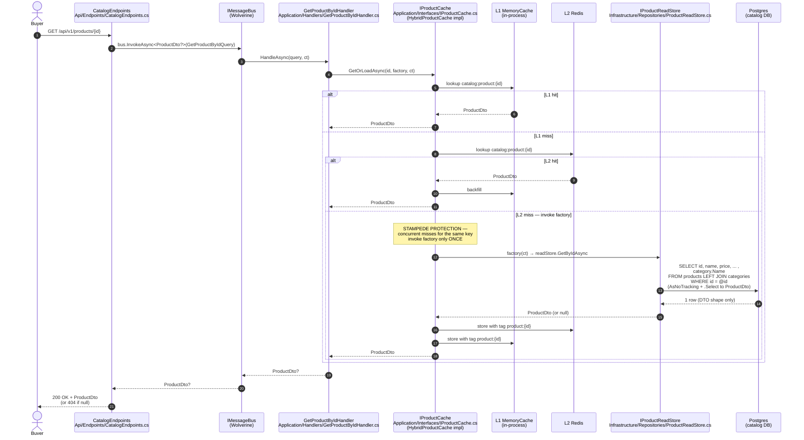
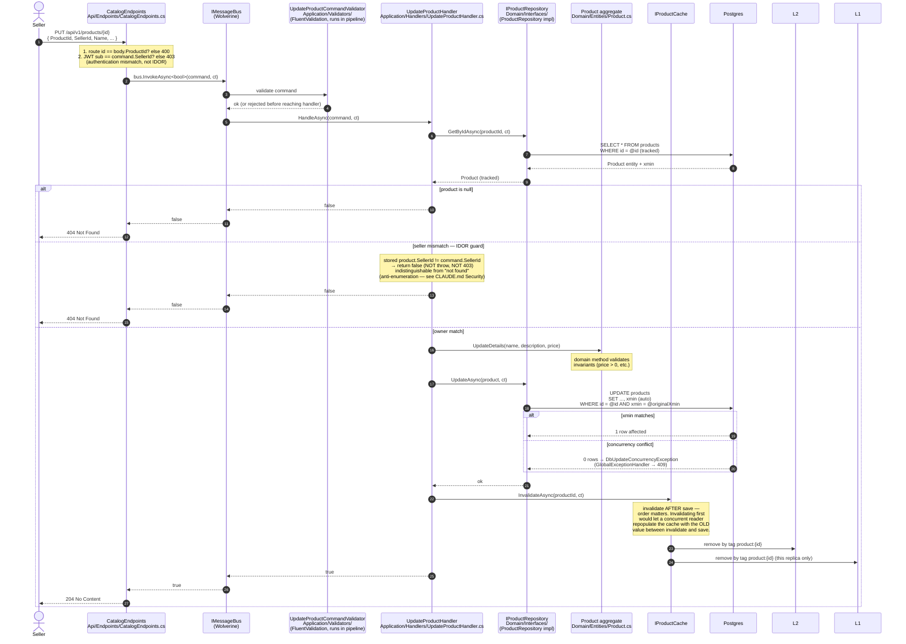
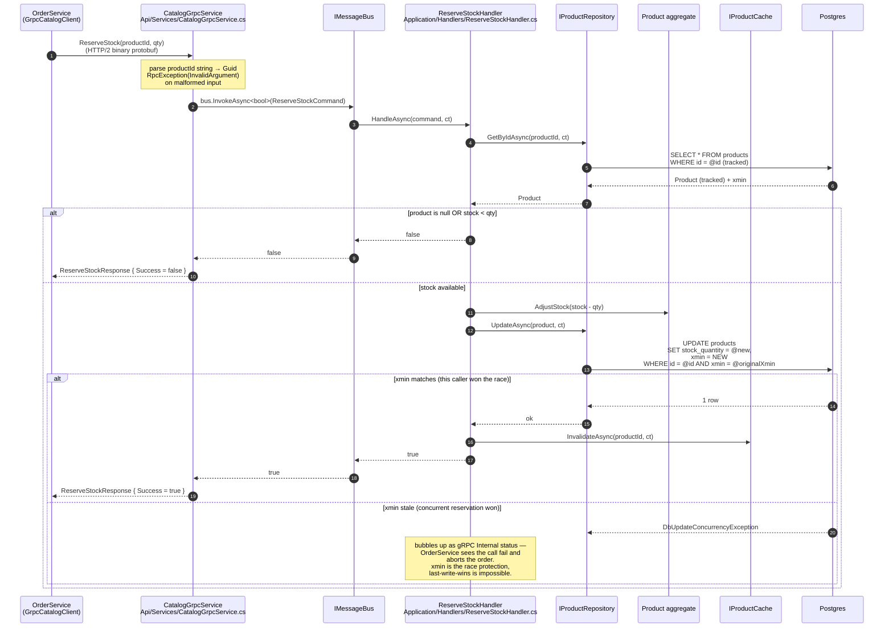
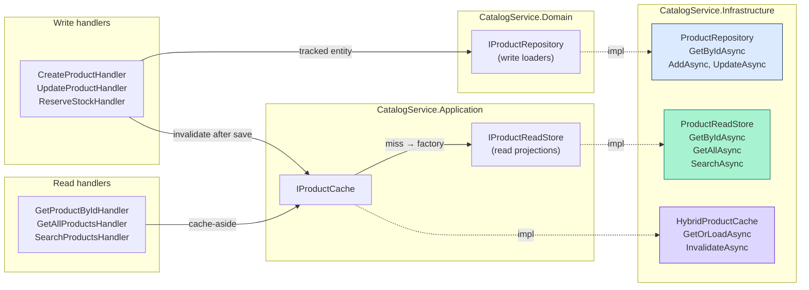

# CatalogService — code flow walkthrough

> **What this is.** A walk through the code paths a new contributor will hit first in [CatalogService](../../CatalogService/). CatalogService owns the product catalog: HTTP for buyer browsing + seller mutations, and a **gRPC server** that OrderService calls synchronously during order placement. Reads go through a two-tier `HybridCache` (in-process L1 + Redis L2); writes invalidate the cache in the same handler that performs the mutation.
>
> **Architecture style:** Clean Architecture, four projects. [`CatalogService.Domain/`](../../CatalogService/CatalogService.Domain) (entities + write-side interfaces, no dependencies), [`CatalogService.Application/`](../../CatalogService/CatalogService.Application) (commands, queries, handlers, read-side interfaces), [`CatalogService.Infrastructure/`](../../CatalogService/CatalogService.Infrastructure) (EF, repositories, cache), [`CatalogService.Api/`](../../CatalogService/CatalogService.Api) (HTTP endpoints, gRPC service, composition root).
>
> **Three flows to understand:**
> 1. **GET product by ID** — HTTP read through `HybridCache` (stampede-protected).
> 2. **PUT product** — HTTP write with seller-scope IDOR check (null → 404), DB write, then cache invalidation in the same handler.
> 3. **gRPC ReserveStock** — synchronous call from OrderService during order placement; mutates `StockQuantity` under an optimistic-concurrency token.

---

## Flow 1 — GET /api/v1/products/{id} (cached read)

**Why projection-in-EF.** The factory hits [`IProductReadStore.GetByIdAsync`](../../CatalogService/CatalogService.Infrastructure/Repositories/ProductReadStore.cs), which projects directly to `ProductDto` inside the `IQueryable` — no entity materialization, no in-memory mapper. The cache stores the DTO, so on hit there's literally nothing to map. See [docs/cqrs-data-access.md](../cqrs-data-access.md) for the rule.

**Negative caching.** If `GetByIdAsync` returns `null`, the cache stores `null`. Subsequent lookups for that ID skip the DB. Safe here because product IDs are server-generated GUIDs — a "not found now, exists later" race is effectively impossible.

---

## Flow 2 — PUT /api/v1/products/{id} (seller-scoped write + invalidation)

**Two-tier ownership check.** The endpoint catches the case where a caller submits SOMEONE ELSE's `SellerId` in the body (403 — that's authentication-mismatch, the caller lied about identity). The handler catches the case where a caller submits THEIR own `SellerId` paired with another seller's product ID (404 — IDOR, anti-enumeration). Both layers are required: each one alone has a bypass.

**Multi-replica cache caveat.** `HybridCache` has no backplane in .NET 10. `InvalidateAsync` clears L2 (Redis) and the L1 of *this* replica only; other replicas continue serving stale `ProductDto` from their own L1 for up to `LocalCacheExpiration` (5 min). Documented in [HybridProductCache.cs](../../CatalogService/CatalogService.Infrastructure/Caching/HybridProductCache.cs) and the deferred follow-up in [STATUS.md](../STATUS.md).

---

## Flow 3 — gRPC ReserveStock (called by OrderService)

This is the synchronous server-side of the cross-service path you saw in OrderService's `PlaceOrderHandler`. OrderService calls `ReserveStockAsync` once per line; each call enters here.

**Why gRPC instead of REST for this path.** Service-to-service hot calls benefit from binary protobuf (~5× smaller payloads than JSON), HTTP/2 multiplexing, and generated client stubs with zero serialization ambiguity. Browser-facing APIs stay REST.

**Same handler as HTTP — no logic duplication.** Both `CatalogGrpcService.ReserveStock` (this flow) and any future HTTP endpoint for stock adjustment dispatch through `bus.InvokeAsync<bool>(new ReserveStockCommand(...))`. The handler is the single source of truth for the business rules; gRPC and HTTP are interchangeable transports.

---

## Read/write data-access split

CatalogService is the Clean Architecture variant of the [CQRS data-access rule](../cqrs-data-access.md): write loaders live on the Domain-layer `IProductRepository`; read projections live on a separate Application-layer `IProductReadStore`. The split exists because the Domain project doesn't reference `NextAurora.Contracts` (where DTOs live), so a DTO-returning method can't sit on a Domain interface.

The method signature is the contract: anything returning `Product` is a write loader; anything returning `ProductDto` is a read projection. The write path also invalidates the cache in the same handler.

---

## File inventory

| Path | Purpose |
|---|---|
| [Api/Endpoints/CatalogEndpoints.cs](../../CatalogService/CatalogService.Api/Endpoints/CatalogEndpoints.cs) | HTTP surface: GET (public), POST/PUT (seller-scoped with two-tier check) |
| [Api/Services/CatalogGrpcService.cs](../../CatalogService/CatalogService.Api/Services/CatalogGrpcService.cs) | gRPC server — translates to Wolverine commands/queries (same handlers as HTTP) |
| [Api/Protos/catalog.proto](../../CatalogService/CatalogService.Api/Protos/catalog.proto) | gRPC contract for `GetProduct`, `GetProducts`, `ReserveStock` |
| [Api/Program.cs](../../CatalogService/CatalogService.Api/Program.cs) | Composition root: Wolverine, EF, HybridCache, gRPC, OpenAPI/Scalar |
| [Application/Commands/](../../CatalogService/CatalogService.Application/Commands) | `CreateProductCommand`, `UpdateProductCommand`, `ReserveStockCommand` |
| [Application/Queries/](../../CatalogService/CatalogService.Application/Queries) | `GetProductByIdQuery`, `GetAllProductsQuery`, `SearchProductsQuery` |
| [Application/Handlers/UpdateProductHandler.cs](../../CatalogService/CatalogService.Application/Handlers/UpdateProductHandler.cs) | Write + IDOR seller-scope check + cache invalidation |
| [Application/Handlers/ReserveStockHandler.cs](../../CatalogService/CatalogService.Application/Handlers/ReserveStockHandler.cs) | Stock mutation under xmin token + cache invalidation |
| [Application/Handlers/GetProductByIdHandler.cs](../../CatalogService/CatalogService.Application/Handlers/GetProductByIdHandler.cs) | Cache-aside read; factory hits the read store on miss |
| [Application/Handlers/GetAllProductsHandler.cs](../../CatalogService/CatalogService.Application/Handlers/GetAllProductsHandler.cs) | Paginated list via read store (no cache) |
| [Application/Handlers/SearchProductsHandler.cs](../../CatalogService/CatalogService.Application/Handlers/SearchProductsHandler.cs) | ILIKE search via read store (Postgres `ILike`, case-insensitive) |
| [Application/Interfaces/IProductCache.cs](../../CatalogService/CatalogService.Application/Interfaces/IProductCache.cs) | Cache port: `GetOrLoadAsync` (factory) + `InvalidateAsync` (by tag) |
| [Application/Interfaces/IProductReadStore.cs](../../CatalogService/CatalogService.Application/Interfaces/IProductReadStore.cs) | Read-side port: DTO-returning projection methods |
| [Application/Validators/](../../CatalogService/CatalogService.Application/Validators) | FluentValidation rules; run automatically in Wolverine pipeline |
| [Domain/Entities/Product.cs](../../CatalogService/CatalogService.Domain/Entities/Product.cs) | Aggregate root — factory + invariants + `UpdateDetails` / `AdjustStock` |
| [Domain/Entities/Category.cs](../../CatalogService/CatalogService.Domain/Entities/Category.cs) | Owned by Product (1-to-many) |
| [Domain/Interfaces/IProductRepository.cs](../../CatalogService/CatalogService.Domain/Interfaces/IProductRepository.cs) | Write-side port (tracked entity loaders + Add/Update) |
| [Infrastructure/Repositories/ProductRepository.cs](../../CatalogService/CatalogService.Infrastructure/Repositories/ProductRepository.cs) | EF write-side impl; `Include(p => p.Category)` for tracked loads |
| [Infrastructure/Repositories/ProductReadStore.cs](../../CatalogService/CatalogService.Infrastructure/Repositories/ProductReadStore.cs) | EF read-side impl; `AsNoTracking` + `.Select` projection + `ILike` search |
| [Infrastructure/Caching/HybridProductCache.cs](../../CatalogService/CatalogService.Infrastructure/Caching/HybridProductCache.cs) | `IProductCache` over `Microsoft.Extensions.Caching.Hybrid` (L1+L2 + stampede + tags) |
| [Infrastructure/Data/CatalogDbContext.cs](../../CatalogService/CatalogService.Infrastructure/Data/CatalogDbContext.cs) | EF context — `xmin` concurrency token configured here |
| [Infrastructure/DependencyInjection.cs](../../CatalogService/CatalogService.Infrastructure/DependencyInjection.cs) | DI wiring — registers Repo + ReadStore + Cache |

---

## See also

- [docs/code-flows/orderservice.md](orderservice.md) — OrderService is the caller for `gRPC ReserveStock`
- [docs/cqrs-data-access.md](../cqrs-data-access.md) — read/write split rule (Clean Architecture variant uses `IProductReadStore`)
- [docs/hybridcache-flow.svg](../hybridcache-flow.svg) — diagram of the L1/L2/stampede/tag-invalidation mechanics
- [docs/performance-and-data-correctness.md](../performance-and-data-correctness.md) — full perf rationale incl. caching decisions
