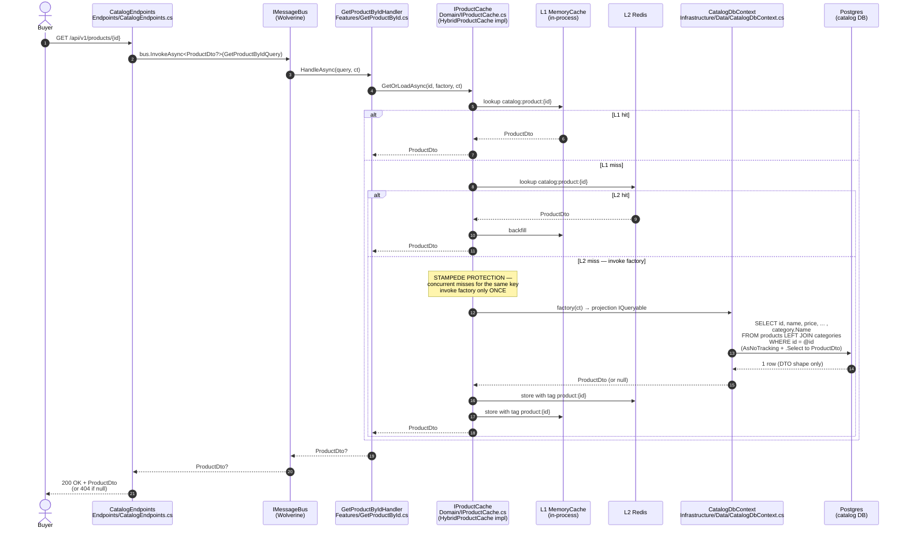
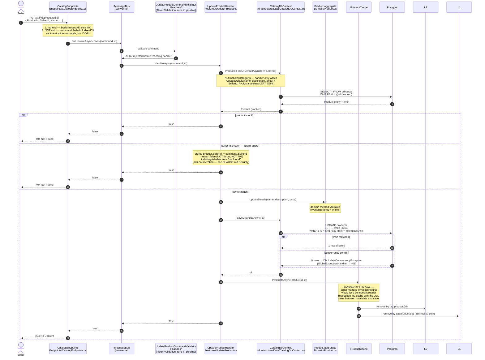
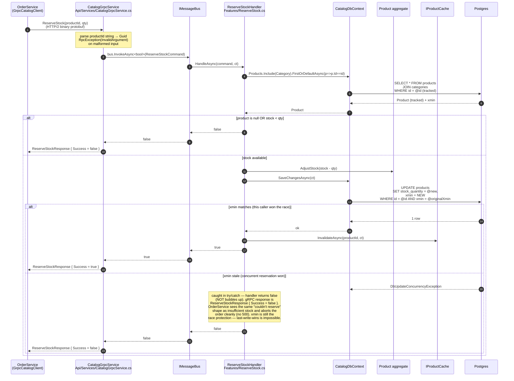
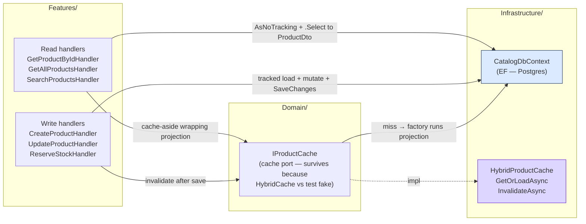

# CatalogService — code flow walkthrough

> **What this is.** A walk through the code paths a new contributor will hit first in [CatalogService](../../CatalogService/). CatalogService owns the product catalog: HTTP for buyer browsing + seller mutations, and a **gRPC server** that OrderService calls synchronously during order placement. Reads go through a two-tier `HybridCache` (in-process L1 + Redis L2); writes invalidate the cache in the same handler that performs the mutation.
>
> **Architecture style:** Vertical Slice Architecture, single csproj. [`Features/`](../../CatalogService/Features) (one file per use case: command/query + validator + handler), [`Domain/`](../../CatalogService/Domain) (Product + Category aggregates, `IProductCache` port), [`Infrastructure/`](../../CatalogService/Infrastructure) (EF `CatalogDbContext` + `HybridProductCache` + migrations + DI), [`Endpoints/`](../../CatalogService/Endpoints) (REST), [`Grpc/`](../../CatalogService/Grpc) (gRPC server). Same shape as the other four services. Previously Clean Architecture (4 projects); collapsed in the VSA refactor because at 2 aggregates the layer split wasn't earning its keep.
>
> **Three flows to understand:**
> 1. **GET product by ID** — HTTP read through `HybridCache` (stampede-protected).
> 2. **PUT product** — HTTP write with seller-scope IDOR check (null → 404), DB write, then cache invalidation in the same handler.
> 3. **gRPC ReserveStock** — synchronous call from OrderService during order placement; mutates `StockQuantity` under an optimistic-concurrency token.

---

## Flow 1 — GET /api/v1/products/{id} (cached read)

**Why projection-in-EF.** The factory runs an inline `context.Products.AsNoTracking().Where(...).Select(p => new ProductDto { ... }).FirstOrDefaultAsync(ct)` — projects directly to `ProductDto` inside the `IQueryable` with no entity materialization and no in-memory mapper. The cache stores the DTO, so on hit there's literally nothing to map. See [docs/cqrs-data-access.md](../cqrs-data-access.md) for the rule.

**Negative caching.** If `GetByIdAsync` returns `null`, the cache stores `null`. Subsequent lookups for that ID skip the DB. Safe here because product IDs are server-generated GUIDs — a "not found now, exists later" race is effectively impossible.

---

## Flow 2 — PUT /api/v1/products/{id} (seller-scoped write + invalidation)

**Two-tier ownership check.** The endpoint catches the case where a caller submits SOMEONE ELSE's `SellerId` in the body (403 — that's authentication-mismatch, the caller lied about identity). The handler catches the case where a caller submits THEIR own `SellerId` paired with another seller's product ID (404 — IDOR, anti-enumeration). Both layers are required: each one alone has a bypass.

**Multi-replica cache caveat.** `HybridCache` has no backplane in .NET 10. `InvalidateAsync` clears L2 (Redis) and the L1 of *this* replica only; other replicas continue serving stale `ProductDto` from their own L1 for up to `LocalCacheExpiration` (5 min). Documented in [HybridProductCache.cs](../../CatalogService/Infrastructure/Caching/HybridProductCache.cs) and the deferred follow-up in [STATUS.md](../STATUS.md).

---

## Flow 3 — gRPC ReserveStock (called by OrderService)

This is the synchronous server-side of the cross-service path you saw in OrderService's `PlaceOrderHandler`. OrderService calls `ReserveStockAsync` once per line; each call enters here.

**Why gRPC instead of REST for this path.** Service-to-service hot calls benefit from binary protobuf (~5× smaller payloads than JSON), HTTP/2 multiplexing, and generated client stubs with zero serialization ambiguity. Browser-facing APIs stay REST.

**Same handler as HTTP — no logic duplication.** Both `CatalogGrpcService.ReserveStock` (this flow) and any future HTTP endpoint for stock adjustment dispatch through `bus.InvokeAsync<bool>(new ReserveStockCommand(...))`. The handler is the single source of truth for the business rules; gRPC and HTTP are interchangeable transports.

---

## Read/write data-access split

CatalogService follows the VSA-everywhere shape of the [CQRS data-access rule](../cqrs-data-access.md): handlers take `CatalogDbContext` directly. The read/write split lives in the *handler's code shape*, not in separate interface methods. There is no `IProductRepository` or `IProductReadStore` — `DbContext` IS Unit-of-Work, `DbSet<T>` IS Repository.

The handler's code shape is the contract: `AsNoTracking().Select(DTO)` is a read; tracked load + mutate via aggregate methods + `SaveChangesAsync` is a write. The write path also invalidates the cache in the same handler.

---

## File inventory

| Path | Purpose |
|---|---|
| [Endpoints/CatalogEndpoints.cs](../../CatalogService/Endpoints/CatalogEndpoints.cs) | HTTP surface: GET (public), POST/PUT (seller-scoped with two-tier check) |
| [Grpc/CatalogGrpcService.cs](../../CatalogService/Grpc/CatalogGrpcService.cs) | gRPC server — translates to Wolverine commands/queries (same handlers as HTTP) |
| [Protos/catalog.proto](../../CatalogService/Protos/catalog.proto) | gRPC contract for `GetProduct`, `GetProducts`, `ReserveStock` |
| [Program.cs](../../CatalogService/Program.cs) | Composition root: Wolverine, EF, HybridCache, gRPC, OpenAPI/Scalar |
| [Features/CreateProduct.cs](../../CatalogService/Features/CreateProduct.cs) | Command + validator + handler: create product (seller-scoped at endpoint) |
| [Features/UpdateProduct.cs](../../CatalogService/Features/UpdateProduct.cs) | Write + IDOR seller-scope check + cache invalidation |
| [Features/ReserveStock.cs](../../CatalogService/Features/ReserveStock.cs) | Stock mutation under xmin token + cache invalidation |
| [Features/GetProductById.cs](../../CatalogService/Features/GetProductById.cs) | Cache-aside read; factory runs the inline EF projection on miss |
| [Features/GetAllProducts.cs](../../CatalogService/Features/GetAllProducts.cs) | Paginated list (no cache); inline `AsNoTracking().Select(ProductDto)` |
| [Features/SearchProducts.cs](../../CatalogService/Features/SearchProducts.cs) | ILIKE search via inline projection (Postgres `EF.Functions.ILike`) |
| [Domain/Product.cs](../../CatalogService/Domain/Product.cs) | Aggregate root — factory + invariants + `UpdateDetails` / `AdjustStock` |
| [Domain/Category.cs](../../CatalogService/Domain/Category.cs) | Owned by Product (1-to-many) |
| [Domain/IProductCache.cs](../../CatalogService/Domain/IProductCache.cs) | Cache port: `GetOrLoadAsync` (factory) + `InvalidateAsync` (by tag) |
| [Infrastructure/Caching/HybridProductCache.cs](../../CatalogService/Infrastructure/Caching/HybridProductCache.cs) | `IProductCache` over `Microsoft.Extensions.Caching.Hybrid` (L1+L2 + stampede + tags) |
| [Infrastructure/Data/CatalogDbContext.cs](../../CatalogService/Infrastructure/Data/CatalogDbContext.cs) | EF context — `xmin` concurrency token configured here |
| [Infrastructure/DependencyInjection.cs](../../CatalogService/Infrastructure/DependencyInjection.cs) | DI wiring — DbContext + HybridCache + read-handler registrations |

---

## Open questions

**`HybridCache` has no cross-replica L1 invalidation backplane.** This is documented inline in [HybridProductCache.cs](../../CatalogService/Infrastructure/Caching/HybridProductCache.cs) and in [STATUS.md](../STATUS.md). When a write handler calls `InvalidateAsync`, L2 (Redis) is cleared globally, but L1 (in-process MemoryCache) is cleared only on **this replica** — other replicas continue serving the stale `ProductDto` from their own L1 for up to `LocalCacheExpiration` (5 min). For Catalog reads this is tolerable; for permissions, pricing, or feature flags it wouldn't be. Today this doesn't bite because we deploy single-replica.

**Two real fixes when multi-replica lands**, both spelled out in [Milan Jovanović — *Solving the distributed cache invalidation problem with Redis and HybridCache*](https://www.milanjovanovic.tech/blog/solving-the-distributed-cache-invalidation-problem-with-redis-and-hybridcache):

1. **Hand-roll a Redis Pub/Sub backplane** (~50-100 lines). Add an `ICacheInvalidator` whose publisher writes the cleared cache key to a `cache-invalidation` channel via our existing `IConnectionMultiplexer`. An `IHostedService` subscribes and calls `HybridCache.RemoveAsync(key)` locally on every replica when a message arrives. Self-publishes are redundant but harmless. Reuses our existing Redis — no new infrastructure dependency. The `IProductCache` seam doesn't change; handlers don't change.
2. **Migrate `IProductCache` to FusionCache.** FusionCache ships the Pub/Sub backplane built in and provides `.AsHybridCache()` so `Microsoft.Extensions.Caching.Hybrid.HybridCache` call sites keep working unchanged. Cleaner long-term, heavier short-term — new package, OTel re-verify, chaos test for the backplane behaviour under Redis partition. Estimate ~half day.

The band-aid mitigation (dropping `LocalCacheExpiration` to 60s) is what [STATUS.md](../STATUS.md) currently positions as the acceptable interim for shipping multi-replica with reasonable consistency in a single sprint, but the article frames it as a band-aid rather than a fix — shorter TTL shrinks the inconsistency window, doesn't eliminate it, and trades L1 hit rate to do so. For Catalog reads, the band-aid is a defensible interim; for any future cached domain where staleness has correctness consequences (pricing, permissions, flags), go straight to one of the two proper fixes.

**Trigger to act:** a second `CatalogService` replica gets deployed. Not before — pre-optimizing the backplane for a single-replica deployment is the kind of speculation [CLAUDE.md](../../CLAUDE.md) "Measure before optimizing" warns against.

---

## See also

- [docs/code-flows/orderservice.md](orderservice.md) — OrderService is the caller for `gRPC ReserveStock`
- [docs/cqrs-data-access.md](../cqrs-data-access.md) — read/write split rule (handlers take `DbContext` directly across all services)
- [docs/hybridcache-flow.svg](../hybridcache-flow.svg) — diagram of the L1/L2/stampede/tag-invalidation mechanics
- [docs/performance-and-data-correctness.md](../performance-and-data-correctness.md) — full perf rationale incl. caching decisions
- [Milan Jovanović — *Solving the distributed cache invalidation problem with Redis and HybridCache*](https://www.milanjovanovic.tech/blog/solving-the-distributed-cache-invalidation-problem-with-redis-and-hybridcache) — external; source of the "Open questions" framing above
