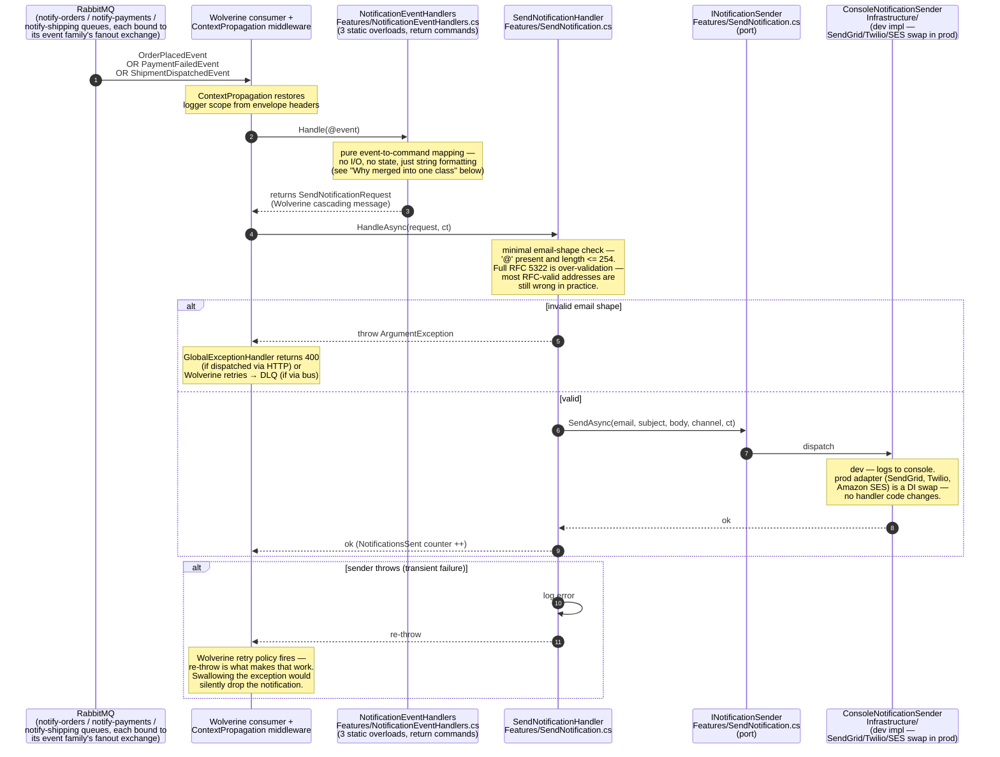
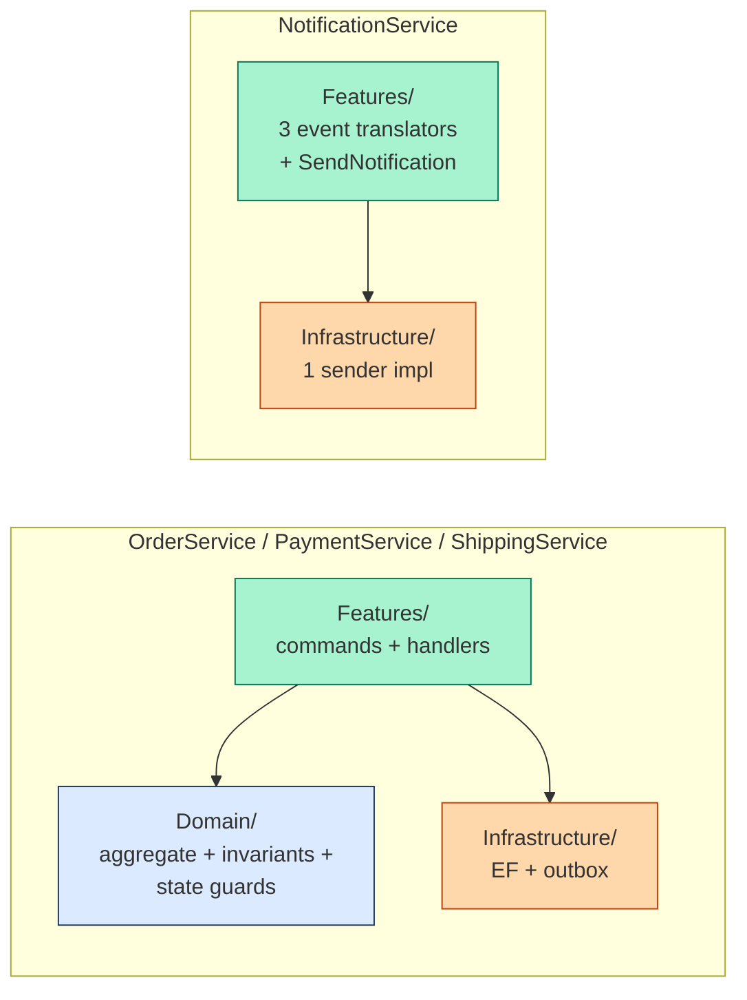

# NotificationService — code flow walkthrough

> **What this is.** A walk through the code paths in [NotificationService](../../NotificationService/) — the **smallest service in the system**. NotificationService is a stateless event-to-email pump: it consumes three events from other services and dispatches an email-like notification via a pluggable sender. No DB, no aggregate, no state worth protecting.
>
> **Architecture style:** Vertical Slice Architecture at its most minimal — **three files in `Features/`**, one in `Infrastructure/`, one `Program.cs`. **No `Domain/` folder at all.** This is the canonical example of "the pattern only earns its keep when there's something to protect": NotificationService has no invariants, no state machine, no aggregate root, so adding one would be pure ceremony. See [CLAUDE.md "Rich Domain Entities (when warranted)"](../../CLAUDE.md).
>
> **One flow to understand:** three events come in (one each from OrderService, PaymentService, ShippingService); each is translated to a `SendNotificationRequest` and dispatched through a single `SendNotificationHandler` that ends in `INotificationSender.SendAsync`.

---

## The flow — events in, email out

**The three event-handler overloads** (all in [NotificationEventHandlers.cs](../../NotificationService/Features/NotificationEventHandlers.cs)):

| Event consumed | Source service | Email subject | Notes |
|---|---|---|---|
| `OrderPlacedEvent` | OrderService | "Order Received" | Buyer ID in event → placeholder email |
| `PaymentFailedEvent` | PaymentService | "Payment Failed" | Reflects raw gateway `Reason` (TODO: translate to user-friendly copy) |
| `ShipmentDispatchedEvent` | ShippingService | "Order Shipped" | Buyer ID in event → placeholder email (`BuyerId` denormalized from the Shipment aggregate) |

**Why all three overloads in one class.** Each handler is pure event-to-command mapping with no state and no branching beyond string formatting. Splitting them into separate classes would be uniform with the saga services (OrderService) but doesn't earn its keep here. If one grows real logic (lookup against a user-prefs cache, channel selection, A/B copy), promote it back to its own file at that point. The pattern explicitly allows this in [SendNotification.cs](../../NotificationService/Features/SendNotification.cs) — VSA puts what-changes-together in one place.

**Why no `IRecipientResolver` abstraction.** There used to be a stub `RecipientResolver` returning the same placeholder emails. It was deleted because the stub didn't enforce any contract that mattered — the abstraction wasn't earning its keep (per CLAUDE.md's "Interfaces earn their keep through consumer substitution"). When a real recipient lookup lands (gRPC to a user service, or a local cache hydrated from `UserCreated` events), introduce the seam at that point.

---

## Why no `Domain/` folder

NotificationService is the minimal counter-example to OrderService / PaymentService / ShippingService. Compare:

What's missing on the right side is **a `Domain/` folder** — because there's nothing for one to hold:

- **No persisted state.** Nothing to put a concurrency token on, nothing to validate, no aggregate to load and mutate.
- **No business invariants.** The "rule" is "send the email" — that's not an invariant, it's a function.
- **No state machine.** The notification is a fire-and-forget event; there's no "Pending → Sent → Delivered" lifecycle the service tracks.

Adding a `Notification` entity with `Create()`, status enum, `private set` properties — would be the kind of speculative ceremony CLAUDE.md warns against. The shape matches the complexity; promote later if real domain rules emerge.

---

## File inventory

| Path | Purpose |
|---|---|
| [Features/NotificationEventHandlers.cs](../../NotificationService/Features/NotificationEventHandlers.cs) | Three static `Handle(@event)` overloads — each returns a `SendNotificationRequest` (Wolverine cascading) |
| [Features/SendNotification.cs](../../NotificationService/Features/SendNotification.cs) | The request record + `INotificationSender` port + `SendNotificationHandler` (all in one file — VSA) |
| [Infrastructure/ConsoleNotificationSender.cs](../../NotificationService/Infrastructure/ConsoleNotificationSender.cs) | Dev-time `INotificationSender` impl — logs instead of sending |
| [Infrastructure/DependencyInjection.cs](../../NotificationService/Infrastructure/DependencyInjection.cs) | DI wiring (registers the sender impl) |
| [Program.cs](../../NotificationService/Program.cs) | Composition root — Wolverine + RabbitMQ queue bindings (notify-orders / notify-payments / notify-shipping, plus the direct send-notification queue) + sender |

---

## See also

- [docs/code-flows/orderservice.md](orderservice.md) — produces `OrderPlacedEvent` (Flow input #1)
- [docs/code-flows/paymentservice.md](paymentservice.md) — produces `PaymentFailedEvent` (Flow input #2)
- [docs/code-flows/shippingservice.md](shippingservice.md) — produces `ShipmentDispatchedEvent` (Flow input #3)
- [CLAUDE.md "Rich Domain Entities (when warranted)"](../../CLAUDE.md) — the rule that lets this service skip the `Domain/` folder
- [docs/event-catalog.md](../event-catalog.md) — every event's shape and producer/consumer
