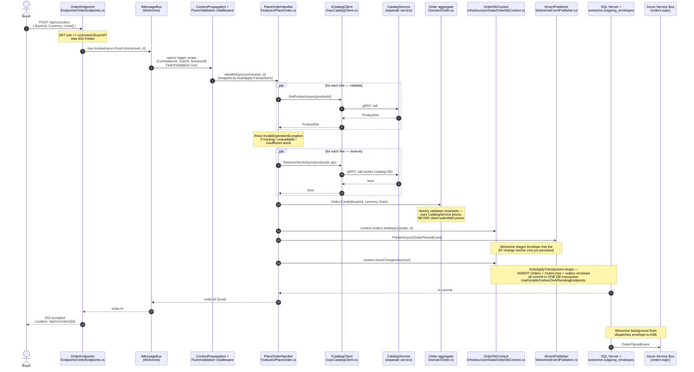
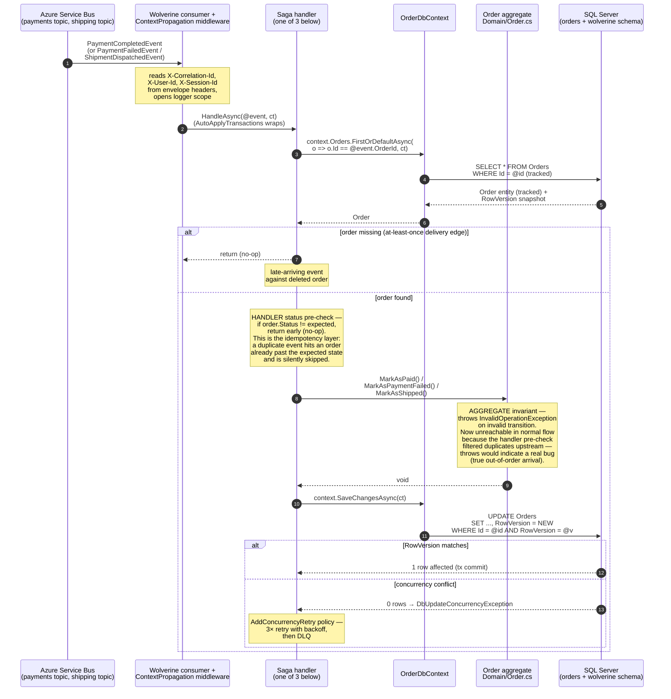
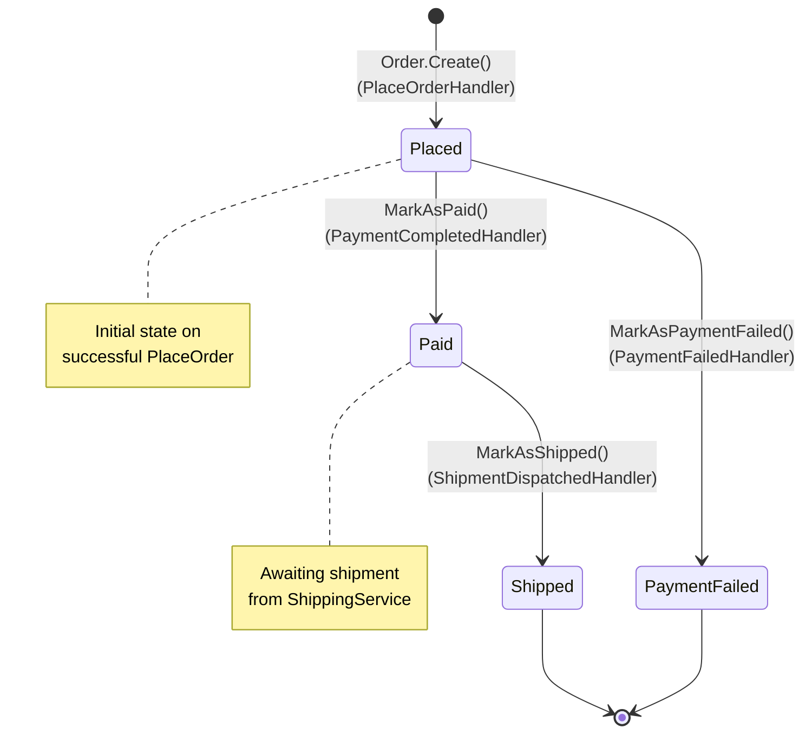
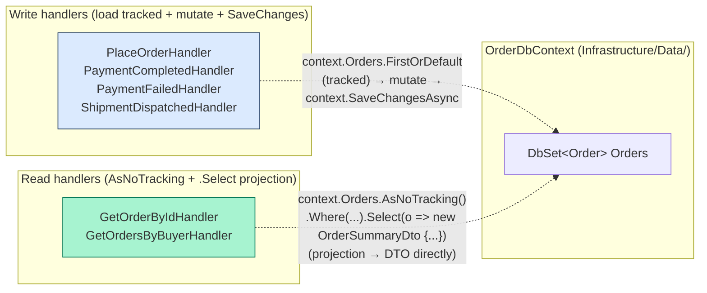

# OrderService — code flow walkthrough

> **What this is.** A walk through the code paths a new contributor will hit first in [OrderService](../../OrderService/). OrderService is the **saga orchestrator** — every order placed here triggers a multi-step workflow that fans out to PaymentService, ShippingService, and NotificationService over Azure Service Bus, then comes back through three event handlers that mutate the Order aggregate. The diagrams below show *which files, classes, and interfaces* get touched at each step, in the order they actually execute.
>
> **Architecture style:** Vertical Slice Architecture (single csproj). Folders: [`Endpoints/`](../../OrderService/Endpoints), [`Features/`](../../OrderService/Features), [`Domain/`](../../OrderService/Domain), [`Infrastructure/`](../../OrderService/Infrastructure). Composition root: [`Program.cs`](../../OrderService/Program.cs).
>
> **Two flows to understand:**
> 1. **Phase 1 — Request-driven (PlaceOrder):** buyer POSTs an order, OrderService validates against Catalog over gRPC, persists, and publishes `OrderPlacedEvent` via the transactional outbox.
> 2. **Phase 2 — Event-driven (saga consume):** three events come back over Service Bus — `PaymentCompletedEvent`, `PaymentFailedEvent`, `ShipmentDispatchedEvent` — each one transitions the Order through its state machine.

---

## Phase 1 — Place order (request-driven)



**Key wiring (in [`Program.cs`](../../OrderService/Program.cs)):**

```csharp
opts.PersistMessagesWithSqlServer(connectionString, "wolverine");
opts.UseEntityFrameworkCoreTransactions();
opts.Policies.AutoApplyTransactions();
opts.Policies.UseDurableOutboxOnAllSendingEndpoints();
opts.AddNextAuroraContextPropagation();   // logger scope from ServiceDefaults
opts.UseFluentValidation();
opts.AddConcurrencyRetry();               // OnException<DbUpdateConcurrencyException>
```

**Why two batch calls** (validate, then reserve) instead of one combined pass: a validation failure on line 3 must NOT trigger any reservation. Splitting the phases makes partial-commit impossible at the validation layer, and the reservation phase itself is **atomic all-or-nothing on the Catalog side** (`ReserveLines` runs every line in one DB transaction — see the CatalogService code-flow). Each phase is ONE gRPC round-trip regardless of order size; the previous shape (`Task.WhenAll` over per-line `GetProduct`/`ReserveStock` calls) paid N parallel round-trips per phase and could leave partial reservations when one line lost Catalog's concurrency check (issue #71).

---

## Phase 2 — Saga consume (event-driven)

Three events come back over Service Bus. They all follow the same shape: ASB → Wolverine consumer → middleware restores logger scope from envelope headers → handler loads the tracked `Order` aggregate → **handler pre-checks status** (idempotency: returns early on duplicate) → calls a named state-transition method on the aggregate (invariant: throws on invalid transition) → `SaveChanges`. **Two layers, two responsibilities** — the handler does idempotency (no-op on duplicate); the aggregate does invariant enforcement (throw on invalid state). See [`PaymentCompletedHandler.cs`](../../OrderService/Features/PaymentCompletedHandler.cs) for the status pre-check, and [`Order.cs:MarkAsPaid`](../../OrderService/Domain/Order.cs) for the invariant throw.



**The three saga handlers all sit in [`Features/`](../../OrderService/Features):**

| Event consumed | Handler | State transition | Aggregate method |
|---|---|---|---|
| `PaymentCompletedEvent` | [PaymentCompletedHandler.cs](../../OrderService/Features/PaymentCompletedHandler.cs) | `Placed → Paid` | `Order.MarkAsPaid()` |
| `PaymentFailedEvent` | [PaymentFailedHandler.cs](../../OrderService/Features/PaymentFailedHandler.cs) | `Placed → PaymentFailed` | `Order.MarkAsPaymentFailed()` |
| `ShipmentDispatchedEvent` | [ShipmentDispatchedHandler.cs](../../OrderService/Features/ShipmentDispatchedHandler.cs) | `Paid → Shipped` | `Order.MarkAsShipped()` |

---

## Order aggregate — state machine

The state machine has **two enforcement layers, each with a different job**. The aggregate methods (`MarkAsPaid`, `MarkAsPaymentFailed`, `MarkAsShipped`) **throw `InvalidOperationException` on any invalid transition** — they're invariant guards, not idempotency guards. The handlers (`PaymentCompletedHandler`, `PaymentFailedHandler`, `ShipmentDispatchedHandler`) **pre-check the aggregate's `Status` and return early if it doesn't match the expected source state** — that's the idempotency layer. A duplicate `PaymentCompletedEvent` hits a handler whose pre-check sees `Status = Paid` (already transitioned) and returns silently; the aggregate's throw is unreachable on the duplicate path. A truly out-of-order event — e.g. `ShipmentDispatchedEvent` arriving before `PaymentCompletedEvent` — would skip the pre-check (the order is in `Placed`, not the expected `Paid`) and also no-op at the handler; the aggregate's throw is the backstop for the case where the handler logic itself is buggy and forgets the pre-check.



---

## Read/write split (CQRS data-access pattern)

There's no `IOrderRepository` wrapper. Handlers take [`OrderDbContext`](../../OrderService/Infrastructure/Data/OrderDbContext.cs) directly — `DbContext` IS Unit-of-Work and `DbSet<T>` IS Repository, so wrapping them adds layers without capability. The CQRS read/write split lives at the **code shape** in each handler, not at the interface level:



The handler's *code shape* is the contract — load-then-mutate-then-save is a write; `AsNoTracking() + .Select(...)` inline is a read. There's no separate "method on a repository interface" layer to enforce the split via type signatures. The discipline lives at PR review time + CodeRabbit + the architecture-reviewer agent's pattern checklist. See [docs/cqrs-data-access.md](../cqrs-data-access.md) for the mechanism (EF auto-splits projected collection navigations so reads have no parent-cartesian rows).

---

## File inventory

| Path | Purpose |
|---|---|
| [Endpoints/OrderEndpoints.cs](../../OrderService/Endpoints/OrderEndpoints.cs) | HTTP surface: POST/GET buyer-scoped, JWT `NameIdentifier` extracted at endpoint and passed in as `RequestingBuyerId` for every scoped query/command |
| [Features/PlaceOrder.cs](../../OrderService/Features/PlaceOrder.cs) | Command + validator + handler (the entry to the saga) |
| [Features/GetOrderById.cs](../../OrderService/Features/GetOrderById.cs) | Single-order read with **buyer-ownership predicate in the EF Where clause** (`Id == OrderId AND BuyerId == RequestingBuyerId`). Non-owner → null → 404 (anti-enumeration per CLAUDE.md "Security Requirements"). Projects to DTO inline via `AsNoTracking() + .Select(...)`. |
| [Features/GetOrdersByBuyer.cs](../../OrderService/Features/GetOrdersByBuyer.cs) | Paginated buyer history; same projection shape + pagination clamp |
| [Features/PaymentCompletedHandler.cs](../../OrderService/Features/PaymentCompletedHandler.cs) | Saga step 2a: payment succeeded → mark paid |
| [Features/PaymentFailedHandler.cs](../../OrderService/Features/PaymentFailedHandler.cs) | Saga step 2b: payment failed → mark failed |
| [Features/ShipmentDispatchedHandler.cs](../../OrderService/Features/ShipmentDispatchedHandler.cs) | Saga step 3: shipment dispatched → mark shipped |
| [Domain/Order.cs](../../OrderService/Domain/Order.cs) | Aggregate root + state transitions + invariants |
| [Domain/OrderLine.cs](../../OrderService/Domain/OrderLine.cs) | Line-item entity, owned by Order |
| [Domain/OrderStatus.cs](../../OrderService/Domain/OrderStatus.cs) | Enum: Placed / Paid / PaymentFailed / Shipped |
| [Domain/ICatalogClient.cs](../../OrderService/Domain/ICatalogClient.cs) | gRPC client port (substituted in tests) |
| [Domain/IEventPublisher.cs](../../OrderService/Domain/IEventPublisher.cs) | Event publish port (Wolverine implementation) |
| [Infrastructure/GrpcCatalogClient.cs](../../OrderService/Infrastructure/GrpcCatalogClient.cs) | gRPC adapter to CatalogService |
| [Infrastructure/WolverineEventPublisher.cs](../../OrderService/Infrastructure/WolverineEventPublisher.cs) | Wolverine `IMessageBus.PublishAsync` adapter |
| [Infrastructure/Data/OrderDbContext.cs](../../OrderService/Infrastructure/Data/OrderDbContext.cs) | EF Core context; SQL Server `RowVersion` concurrency token |
| [Program.cs](../../OrderService/Program.cs) | Composition root: Wolverine + EF + auth + transports |

---

## Open questions

**Per-aggregate ordering is handled via handler-level status checks + aggregate-level invariant throws + RowVersion retry, not via bus-level sessions.** Wolverine consumers on the same subscription compete, so two events for the same `OrderId` *can* be processed simultaneously by different replicas. Our defense is layered: each handler pre-checks `Status` and returns early on duplicate (idempotency); the aggregate's `MarkAsX` methods throw on invalid transitions (invariant); the `RowVersion` token rejects the stale writer (`DbUpdateConcurrencyException`); Wolverine's `AddConcurrencyRetry` policy retries 3× with backoff against the now-fresh state; the message lands in the DLQ only if all retries fail. That works in principle, and matches the "model the workflow, don't fight the queue" pattern from [Milan Jovanović's *Solving message ordering from first principles*](https://www.milanjovanovic.tech/blog/solving-message-ordering-from-first-principles). The alternative — Azure Service Bus sessions keyed on `OrderId`, with Wolverine's session-aware consumers — would give us a hard ordering guarantee but doesn't replace any of the above (sessions fix ordering, not duplicate delivery), so it's additive insurance rather than a replacement.

**The validation is undertested.** Our integration tests each create their own order, so the *concurrent same-aggregate* path the post warns about ("a subtle bug that only appears under load") is exactly the path with zero coverage. Two cheap things would change that without committing to bus sessions: (1) an integration test that fires `PaymentCompletedEvent` and `ShipmentDispatchedEvent` against the same `Order` simultaneously and asserts the final state lands at `Shipped` (not `PaymentFailed` or stuck at `Placed`); (2) a `payments_concurrency_retries_exhausted` / `orders_concurrency_retries_exhausted` counter so DLQ-bound retry exhaustion is observable in production, not invisible. If those metrics stay near zero, the state-guard pattern is validated and bus sessions are unnecessary. If they spike, that's the trigger to add sessions — evidence-driven, not architecture-astronaut-driven. There's no Inbox pattern (processed-message-ID table) today either; state guards catch most duplicates because aggregates have few valid transitions, but a proper Inbox would catch any duplicate before it reaches the handler. Add it if duplicates start appearing outside the state-guard-protected windows.

---

## See also

- [docs/architecture.md](../architecture.md) — system-level view
- [docs/cqrs-data-access.md](../cqrs-data-access.md) — read/write split rule
- [docs/transactional-outbox.svg](../transactional-outbox.svg) — outbox mechanics diagram
- [docs/event-catalog.md](../event-catalog.md) — every event's shape and producer/consumer
- [Milan Jovanović — *Solving message ordering from first principles*](https://www.milanjovanovic.tech/blog/solving-message-ordering-from-first-principles) — external; the source of the "Open questions" framing above
