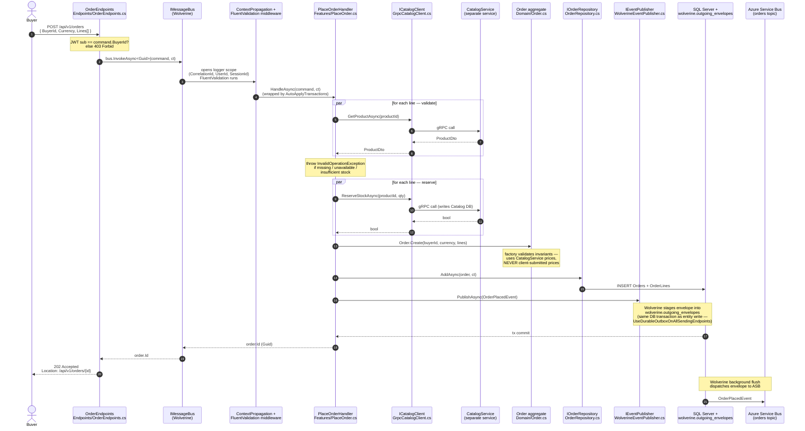
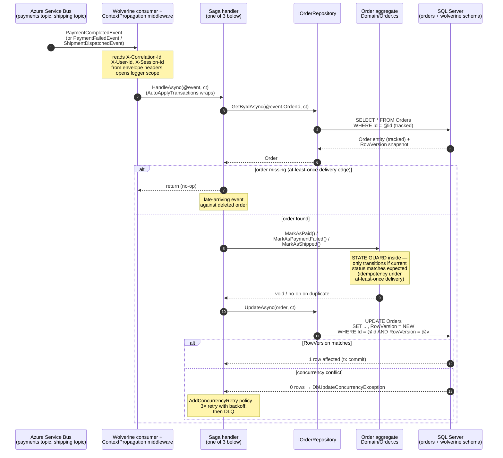
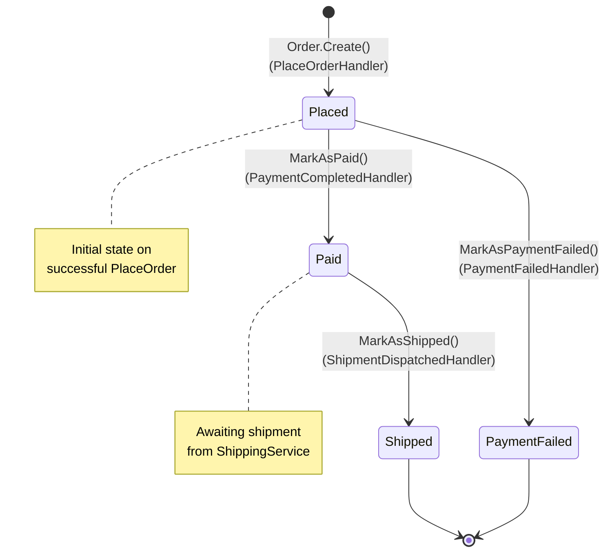
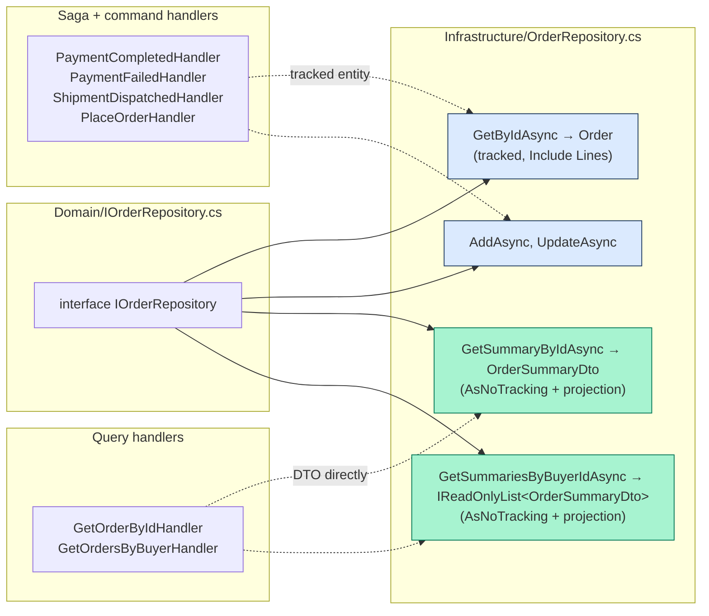

# OrderService — code flow walkthrough

> **What this is.** A walk through the code paths a new contributor will hit first in [OrderService](../../OrderService/). OrderService is the **saga orchestrator** — every order placed here triggers a multi-step workflow that fans out to PaymentService, ShippingService, and NotificationService over Azure Service Bus, then comes back through three event handlers that mutate the Order aggregate. The diagrams below show *which files, classes, and interfaces* get touched at each step, in the order they actually execute.
>
> **Architecture style:** Vertical Slice Architecture (single csproj). Folders: [`Endpoints/`](../../OrderService/Endpoints), [`Features/`](../../OrderService/Features), [`Domain/`](../../OrderService/Domain), [`Infrastructure/`](../../OrderService/Infrastructure). Composition root: [`Program.cs`](../../OrderService/Program.cs).
>
> **Two flows to understand:**
> 1. **Phase 1 — Request-driven (PlaceOrder):** buyer POSTs an order, OrderService validates against Catalog over gRPC, persists, and publishes `OrderPlacedEvent` via the transactional outbox.
> 2. **Phase 2 — Event-driven (saga consume):** three events come back over Service Bus — `PaymentCompletedEvent`, `PaymentFailedEvent`, `ShipmentDispatchedEvent` — each one transitions the Order through its state machine.

---

## Phase 1 — Place order (request-driven)



**Key wiring (in [`Program.cs`](../../OrderService/Program.cs)):**

```csharp
opts.PersistMessagesWithSqlServer(connectionString, "wolverine");
opts.UseEntityFrameworkCoreTransactions();
opts.Policies.AutoApplyTransactions();
opts.Policies.UseDurableOutboxOnAllSendingEndpoints();
opts.AddNextAuroraContextPropagation();   // logger scope from ServiceDefaults
opts.UseFluentValidation();
opts.AddConcurrencyRetry();               // OnException<DbUpdateConcurrencyException>
```

**Why two parallel `Task.WhenAll` blocks** (validate, then reserve) instead of one combined pass: a validation failure on line 3 must NOT leave reservations on lines 1 and 2. Splitting the phases makes partial-commit impossible at the validation layer. See [PlaceOrder.cs:73-79](../../OrderService/Features/PlaceOrder.cs#L73) for the rationale in code.

**`DbContext` thread-safety**: the `Task.WhenAll` parallelism is over **gRPC client calls only** — no OrderService `DbContext` is touched in that block. The CLAUDE.md "DbContext is not thread-safe" rule is satisfied. Each gRPC call hits CatalogService where it gets its own per-request DbContext scope.

---

## Phase 2 — Saga consume (event-driven)

Three events come back over Service Bus. They all follow the same shape: ASB → Wolverine consumer → middleware restores logger scope from envelope headers → handler loads the tracked `Order` aggregate → calls a named state-transition method → `SaveChanges`. The state-transition method enforces idempotency via a status guard (a duplicate event no-ops instead of throwing).



**The three saga handlers all sit in [`Features/`](../../OrderService/Features):**

| Event consumed | Handler | State transition | Aggregate method |
|---|---|---|---|
| `PaymentCompletedEvent` | [PaymentCompletedHandler.cs](../../OrderService/Features/PaymentCompletedHandler.cs) | `Placed → Paid` | `Order.MarkAsPaid()` |
| `PaymentFailedEvent` | [PaymentFailedHandler.cs](../../OrderService/Features/PaymentFailedHandler.cs) | `Placed → PaymentFailed` | `Order.MarkAsPaymentFailed()` |
| `ShipmentDispatchedEvent` | [ShipmentDispatchedHandler.cs](../../OrderService/Features/ShipmentDispatchedHandler.cs) | `Paid → Shipped` | `Order.MarkAsShipped()` |

---

## Order aggregate — state machine

The state machine is enforced *inside* the aggregate methods, not by the handlers or the bus. A handler call to `MarkAsPaid()` on an already-`Paid` order is a no-op, not a throw. This is the **idempotency guard** that makes at-least-once delivery safe.



---

## Read-path coexistence (CQRS data-access split)

The same [`IOrderRepository`](../../OrderService/Domain/IOrderRepository.cs) interface carries **both** write-loader methods (used by the sagas above) and DTO-returning read-projection methods (used by the GET endpoints). The split is part of the project's [CQRS data-access rule](../cqrs-data-access.md) — read paths project to DTOs inside the IQueryable to skip entity materialization and avoid parent-cartesian rows from collection includes.



The method signature is the contract: anything returning a domain entity is a write loader; anything returning a DTO is a read projection. Mixing the two is the anti-pattern the rule exists to prevent.

---

## File inventory

| Path | Purpose |
|---|---|
| [Endpoints/OrderEndpoints.cs](../../OrderService/Endpoints/OrderEndpoints.cs) | HTTP surface: POST/GET buyer-scoped, defense-in-depth JWT check |
| [Features/PlaceOrder.cs](../../OrderService/Features/PlaceOrder.cs) | Command + validator + handler (the entry to the saga) |
| [Features/GetOrderById.cs](../../OrderService/Features/GetOrderById.cs) | Single-order read; delegates to read-projection method |
| [Features/GetOrdersByBuyer.cs](../../OrderService/Features/GetOrdersByBuyer.cs) | Paginated buyer history; delegates to read-projection method |
| [Features/PaymentCompletedHandler.cs](../../OrderService/Features/PaymentCompletedHandler.cs) | Saga step 2a: payment succeeded → mark paid |
| [Features/PaymentFailedHandler.cs](../../OrderService/Features/PaymentFailedHandler.cs) | Saga step 2b: payment failed → mark failed |
| [Features/ShipmentDispatchedHandler.cs](../../OrderService/Features/ShipmentDispatchedHandler.cs) | Saga step 3: shipment dispatched → mark shipped |
| [Domain/Order.cs](../../OrderService/Domain/Order.cs) | Aggregate root + state transitions + invariants |
| [Domain/OrderLine.cs](../../OrderService/Domain/OrderLine.cs) | Line-item entity, owned by Order |
| [Domain/OrderStatus.cs](../../OrderService/Domain/OrderStatus.cs) | Enum: Placed / Paid / PaymentFailed / Shipped |
| [Domain/IOrderRepository.cs](../../OrderService/Domain/IOrderRepository.cs) | Repository port (write loaders + read projections) |
| [Domain/ICatalogClient.cs](../../OrderService/Domain/ICatalogClient.cs) | gRPC client port (substituted in tests) |
| [Domain/IEventPublisher.cs](../../OrderService/Domain/IEventPublisher.cs) | Event publish port (Wolverine implementation) |
| [Infrastructure/OrderRepository.cs](../../OrderService/Infrastructure/OrderRepository.cs) | EF Core repository (write loaders + read projections) |
| [Infrastructure/GrpcCatalogClient.cs](../../OrderService/Infrastructure/GrpcCatalogClient.cs) | gRPC adapter to CatalogService |
| [Infrastructure/WolverineEventPublisher.cs](../../OrderService/Infrastructure/WolverineEventPublisher.cs) | Wolverine `IMessageBus.PublishAsync` adapter |
| [Infrastructure/Data/OrderDbContext.cs](../../OrderService/Infrastructure/Data/OrderDbContext.cs) | EF Core context; SQL Server `RowVersion` concurrency token |
| [Program.cs](../../OrderService/Program.cs) | Composition root: Wolverine + EF + auth + transports |

---

## See also

- [docs/architecture.md](../architecture.md) — system-level view
- [docs/cqrs-data-access.md](../cqrs-data-access.md) — read/write split rule
- [docs/transactional-outbox.svg](../transactional-outbox.svg) — outbox mechanics diagram
- [docs/event-catalog.md](../event-catalog.md) — every event's shape and producer/consumer
