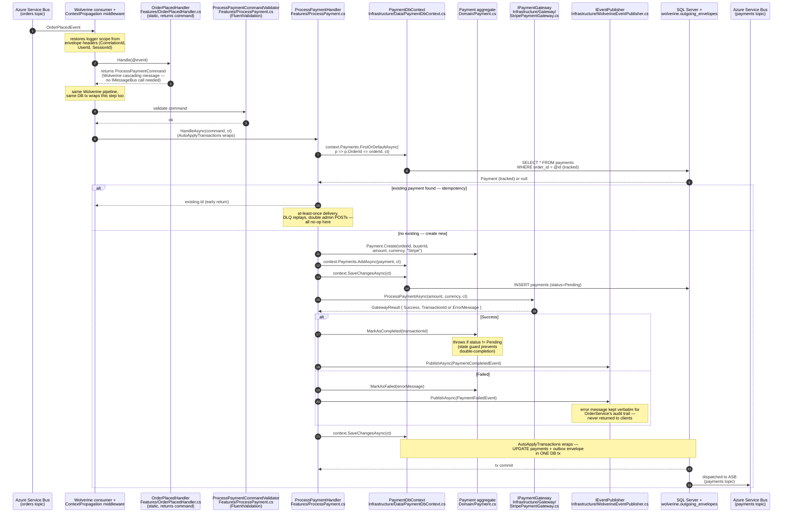
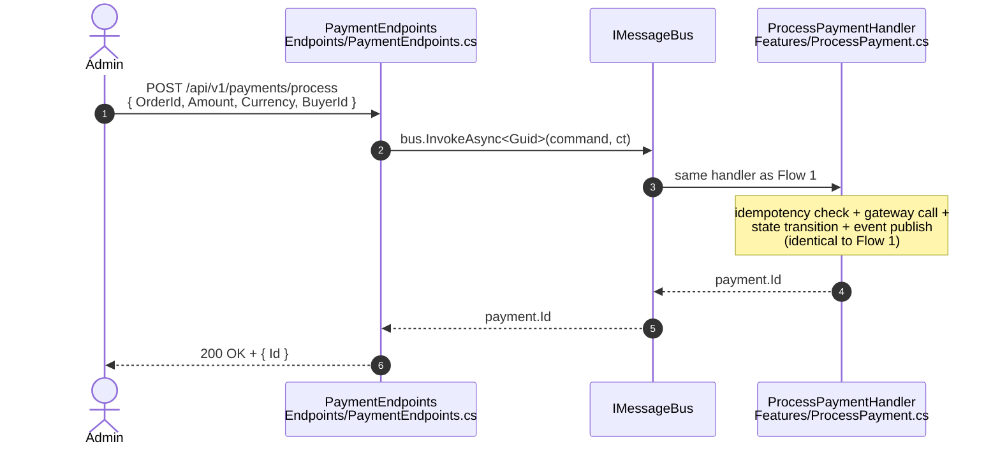
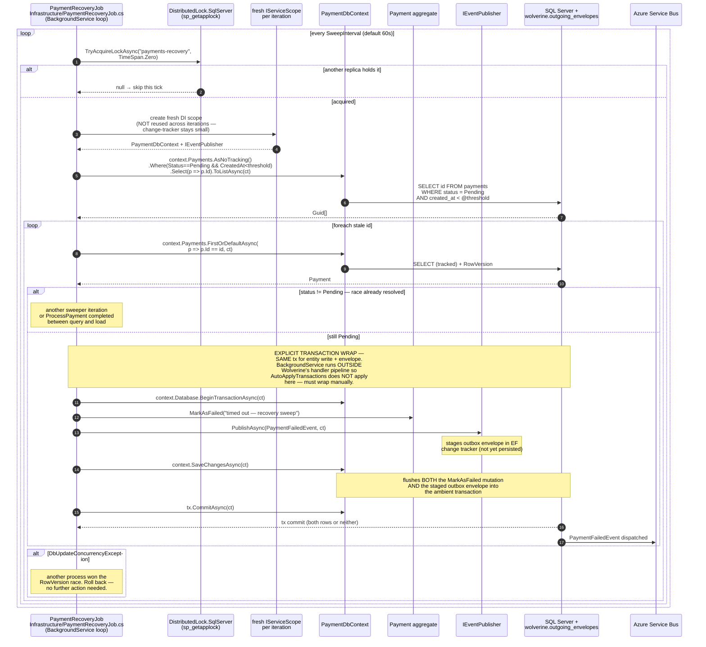
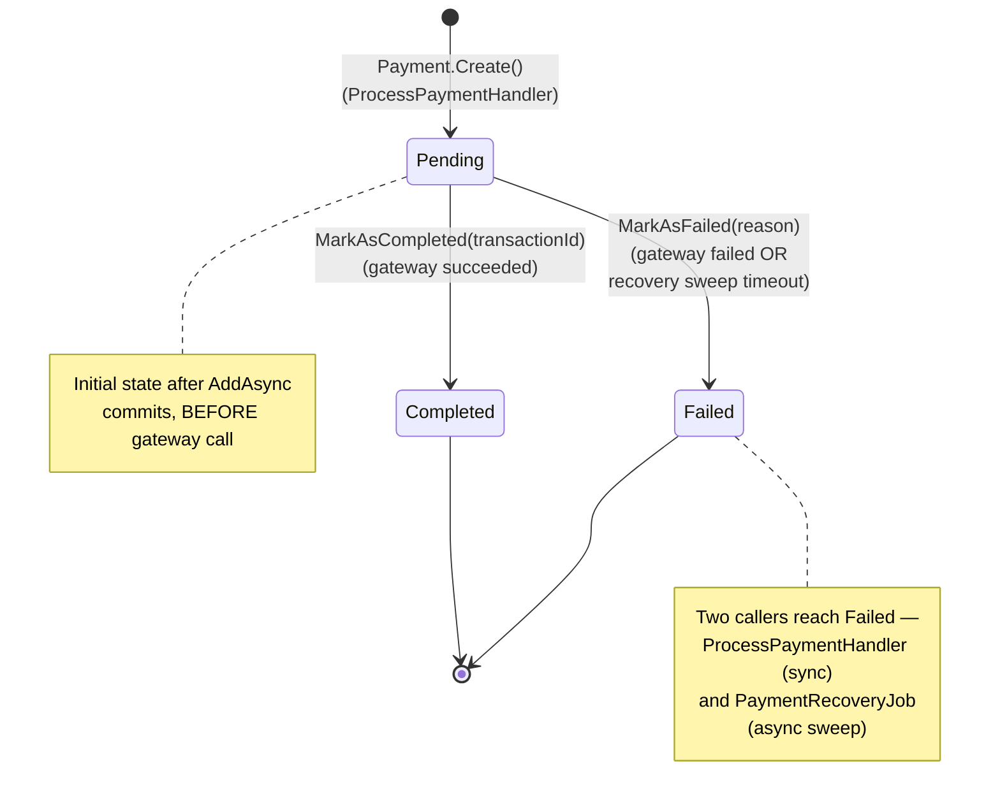

# PaymentService — code flow walkthrough

> **What this is.** A walk through the code paths a new contributor will hit first in [PaymentService](../../PaymentService/). PaymentService is the **saga middle step** — it receives `OrderPlacedEvent` from OrderService over Service Bus, charges via a payment gateway (Stripe), and publishes `PaymentCompletedEvent` or `PaymentFailedEvent`. A `BackgroundService` recovery sweeper handles the "stuck in Pending" case where the gateway hangs.
>
> **Architecture style:** Vertical Slice Architecture (single csproj). Folders: [`Endpoints/`](../../PaymentService/Endpoints), [`Features/`](../../PaymentService/Features), [`Domain/`](../../PaymentService/Domain), [`Infrastructure/`](../../PaymentService/Infrastructure). Composition root: [`Program.cs`](../../PaymentService/Program.cs).
>
> **Three flows to understand:**
> 1. **Saga consume + cascade** — `OrderPlacedEvent` → tiny translator → `ProcessPaymentCommand` → handler charges gateway → publishes outcome event.
> 2. **HTTP admin path** — same `ProcessPaymentCommand` reachable from `POST /api/v1/payments/process` for manual processing.
> 3. **`PaymentRecoveryJob`** — periodic sweeper that catches Pending payments stuck past the stale threshold, wrapping the mark-failed + publish in an explicit `BeginTransactionAsync` → `SaveChangesAsync` → `CommitAsync` so the entity write + outbox envelope stay atomic outside the Wolverine pipeline.

---

## Flow 1 — Saga: `OrderPlacedEvent` → process payment → publish outcome



**Why two handlers (`OrderPlacedHandler` + `ProcessPaymentHandler`).** The event handler is a 2-line translator that converts an event into a command and returns it. Wolverine's "cascading messages" feature picks up the return value and runs its handler next — the same `ProcessPaymentHandler` reached from the HTTP admin endpoint. One business rule, multiple entry points.

**Idempotency via existence check + unique index.** The `context.Payments.FirstOrDefaultAsync(p => p.OrderId == orderId)` lookup short-circuits on existing rows for retry/redelivery scenarios. The unique index on `OrderId` in [PaymentDbContext](../../PaymentService/Infrastructure/Data/PaymentDbContext.cs) is the DB backstop if two redeliveries race past the check at the same instant.

---

## Flow 2 — HTTP `POST /api/v1/payments/process` (admin path)

Same handler, same outcome — different entry point.



The admin endpoint matters because it's how an operator manually triggers a payment when the saga is unavailable (e.g. Service Bus outage). Same code path; same outbox guarantees.

---

## Flow 3 — `PaymentRecoveryJob` (BackgroundService sweeper)

A Pending payment stuck past the stale threshold (default ~5 min — see [PaymentRecoveryOptions](../../PaymentService/Infrastructure/PaymentRecoveryOptions.cs)) is what you get when the gateway call hangs and the process dies mid-transaction. The next pod restart can't recover via the saga because `ProcessPaymentHandler`'s existence check would no-op on the half-written row. The sweeper handles these.



**The outbox-outside-handler trap.** Wolverine's `AutoApplyTransactions` policy wraps **handler chains** — anything dispatched through `IMessageBus.InvokeAsync`/`PublishAsync` into a handler gets the wrap automatically. That includes the admin path in Flow 2 (`POST /payments/process` → `bus.InvokeAsync<Guid>(command)` → `ProcessPaymentHandler`) — it's still inside the Wolverine pipeline, so the wrap applies. The trap is code that publishes events **without entering a handler at all**: `BackgroundService` sweep loops, cron jobs, or any future code path that does `bus.PublishAsync(@event)` outside an active Wolverine handler context. `PublishAsync` stages an envelope into the in-memory tracker, but the envelope is only persisted to `wolverine.outgoing_envelopes` when `SaveChangesAsync` runs after the publish. The canonical safe wrap (now inline in `PaymentRecoveryJob.RecoverOneAsync`, no longer behind a repository method):

```csharp
await using var tx = await context.Database.BeginTransactionAsync(ct);
// entity work...
payment.MarkAsFailed(reason);
await eventPublisher.PublishAsync(new PaymentFailedEvent { ... }, ct);
await context.SaveChangesAsync(ct);   // flushes BOTH entity mutation AND staged envelope
await tx.CommitAsync(ct);
```

See [`PaymentRecoveryJob.RecoverOneAsync`](../../PaymentService/Infrastructure/PaymentRecoveryJob.cs) and the rationale in [docs/performance-and-data-correctness.md](../performance-and-data-correctness.md). This pattern covers any future non-handler code that publishes events.

**Distributed lock.** Multiple PaymentService replicas could each fire their sweep tick at the same second. The `sp_getapplock`-based distributed lock ensures only one replica processes the sweep per tick. `TimeSpan.Zero` (no-wait) means replicas that don't acquire just skip the iteration — they'll try again at the next tick.

**`TimeProvider` injection.** Tests inject `FakeTimeProvider` to advance virtual time and exercise the stale-threshold logic deterministically. The sweep loop never reads `DateTime.UtcNow` directly.

---

## Payment aggregate — state machine



**Idempotency by throw (not no-op).** Unlike OrderService's `Order.MarkAsX` methods (which no-op on duplicate transitions), `Payment.MarkAsCompleted` and `MarkAsFailed` **throw `InvalidOperationException`** if status is not `Pending`. The reason: PaymentService's idempotency lives at the *handler* level (existence check on `OrderId`), not the aggregate level. By the time you're calling `MarkAsX` here, you've already loaded a freshly-created `Pending` payment in the current request — a non-Pending status means a serious bug, not a duplicate event.

---

## File inventory

| Path | Purpose |
|---|---|
| [Endpoints/PaymentEndpoints.cs](../../PaymentService/Endpoints/PaymentEndpoints.cs) | HTTP admin path: `POST /api/v1/payments/process` |
| [Features/OrderPlacedHandler.cs](../../PaymentService/Features/OrderPlacedHandler.cs) | Static event translator (Wolverine cascading message) |
| [Features/ProcessPayment.cs](../../PaymentService/Features/ProcessPayment.cs) | Command + validator + handler (idempotency + gateway + state + publish) |
| [Domain/Payment.cs](../../PaymentService/Domain/Payment.cs) | Aggregate root + state guards (throw on bad transition) |
| [Domain/PaymentStatus.cs](../../PaymentService/Domain/PaymentStatus.cs) | Enum: Pending / Completed / Failed |
| [Domain/IPaymentGateway.cs](../../PaymentService/Domain/IPaymentGateway.cs) | Anti-corruption layer port — substituted in tests |
| [Domain/IEventPublisher.cs](../../PaymentService/Domain/IEventPublisher.cs) | Event publish port (Wolverine impl) |
| [Infrastructure/Gateway/StripePaymentGateway.cs](../../PaymentService/Infrastructure/Gateway/StripePaymentGateway.cs) | Stripe adapter — translates SDK exceptions into `GatewayResult` |
| [Infrastructure/WolverineEventPublisher.cs](../../PaymentService/Infrastructure/WolverineEventPublisher.cs) | `IMessageBus.PublishAsync` adapter |
| [Infrastructure/PaymentRecoveryJob.cs](../../PaymentService/Infrastructure/PaymentRecoveryJob.cs) | `BackgroundService` sweep loop + distributed lock + per-iteration scope |
| [Infrastructure/PaymentRecoveryOptions.cs](../../PaymentService/Infrastructure/PaymentRecoveryOptions.cs) | Config record: SweepInterval, StaleThreshold, LockName |
| [Infrastructure/Data/PaymentDbContext.cs](../../PaymentService/Infrastructure/Data/PaymentDbContext.cs) | EF context — SQL Server `RowVersion` token, unique index on `OrderId` |
| [Program.cs](../../PaymentService/Program.cs) | Composition root — Wolverine + EF + `BackgroundService` registration |

---

## See also

- [docs/code-flows/orderservice.md](orderservice.md) — OrderService publishes `OrderPlacedEvent` (Flow 1's input) and consumes `PaymentCompletedEvent`/`PaymentFailedEvent` (Flow 1's output)
- [docs/transactional-outbox.svg](../transactional-outbox.svg) — diagram of outbox mechanics; the recovery job's inline `BeginTransactionAsync` → `SaveChangesAsync` → `CommitAsync` is the non-handler variant of the same pattern
- [docs/performance-and-data-correctness.md](../performance-and-data-correctness.md) — full perf rationale incl. outbox + sweeper patterns
- [docs/event-catalog.md](../event-catalog.md) — every event's shape and producer/consumer
