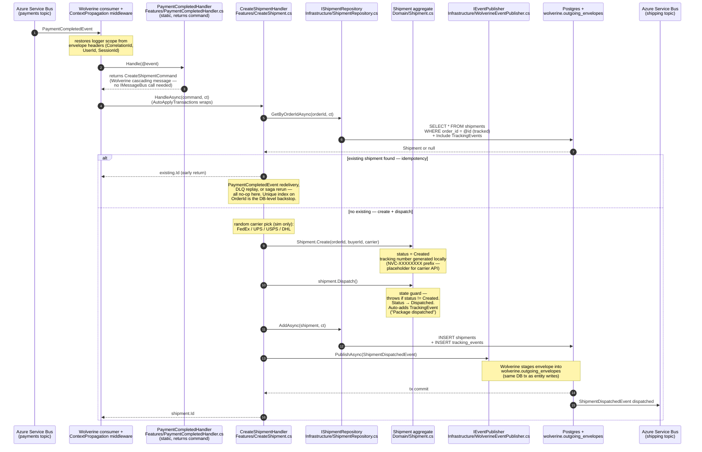
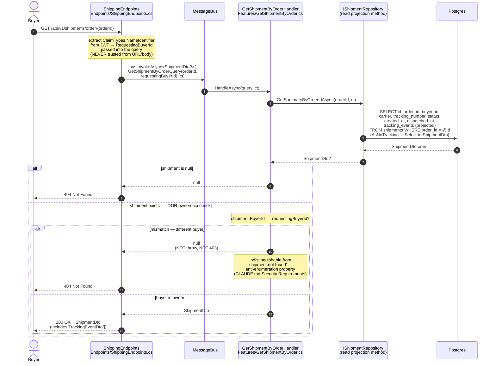
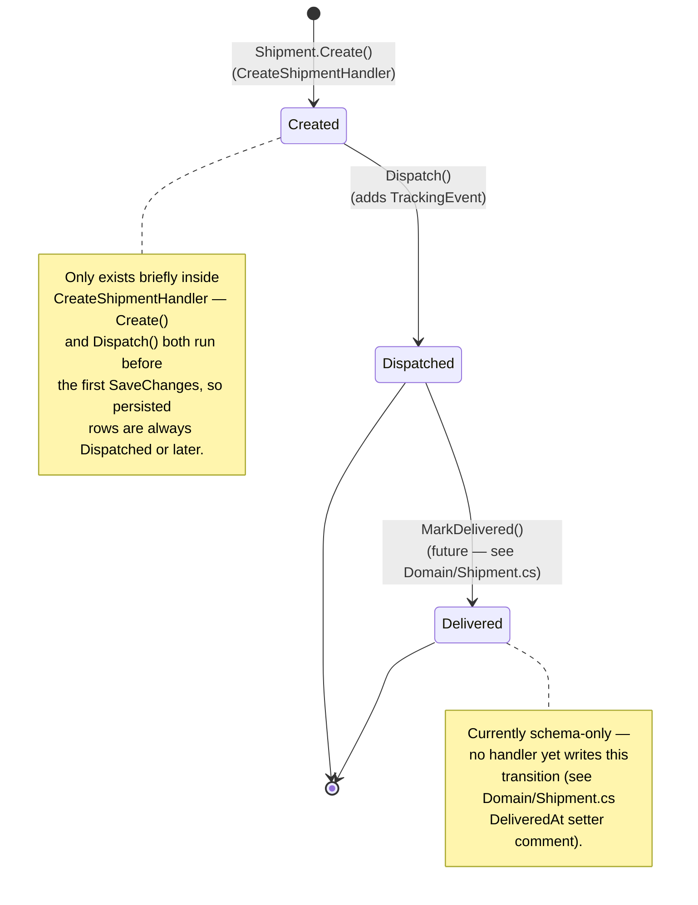
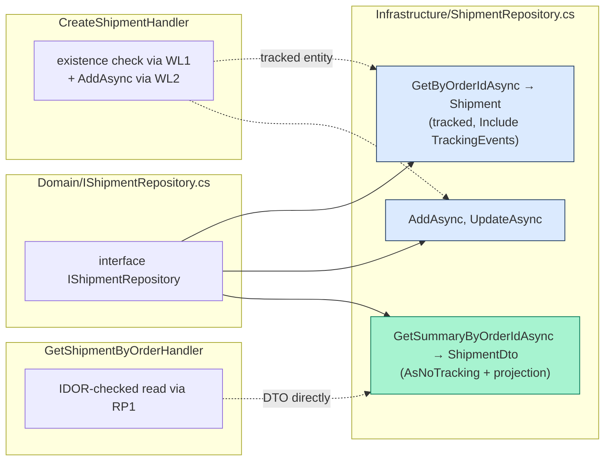

# ShippingService — code flow walkthrough

> **What this is.** A walk through the code paths a new contributor will hit first in [ShippingService](../../ShippingService/). ShippingService is the **saga last step** — it receives `PaymentCompletedEvent` from PaymentService over Service Bus, creates a Shipment + immediately dispatches it (simulation), and publishes `ShipmentDispatchedEvent` for OrderService and NotificationService. Buyers can then query their shipment via a buyer-scoped HTTP endpoint with anti-enumeration IDOR protection.
>
> **Architecture style:** Vertical Slice Architecture (single csproj). Folders: [`Endpoints/`](../../ShippingService/Endpoints), [`Features/`](../../ShippingService/Features), [`Domain/`](../../ShippingService/Domain), [`Infrastructure/`](../../ShippingService/Infrastructure). Composition root: [`Program.cs`](../../ShippingService/Program.cs).
>
> **Two flows to understand:**
> 1. **`PaymentCompletedEvent` consume + cascade** — translator returns `CreateShipmentCommand`, handler creates & dispatches the shipment, publishes `ShipmentDispatchedEvent`.
> 2. **`GET /shipments/order/{orderId}`** — buyer-scoped read with the canonical null → 404 IDOR pattern (see CLAUDE.md "Security Requirements").

---

## Flow 1 — Saga: `PaymentCompletedEvent` → create shipment → publish dispatched

**Two domain operations in one handler.** `Shipment.Create()` (Created state) → `shipment.Dispatch()` (Created → Dispatched). Both before `AddAsync` so a single `SaveChanges` captures the full state transition. The `TrackingEvent` audit row is added inside `Dispatch()` so the audit trail is in place from the very first save.

**Why a thin static event translator.** Same Wolverine "cascading messages" pattern PaymentService uses for `OrderPlacedHandler` — the event handler returns a command, Wolverine invokes the command's handler next. The command handler is also reachable from any future direct trigger (admin endpoint, manual replay) without duplicating logic.

---

## Flow 2 — `GET /api/v1/shipments/order/{orderId}` (IDOR-protected read)

**Why null → 404 instead of throw → 403.** Returning 403 on owner mismatch tells an attacker "this shipment exists, just not yours" — they can enumerate the order-ID space. 404 is indistinguishable from "no shipment for this order." The canonical IDOR pattern in [CLAUDE.md "Security Requirements"](../../CLAUDE.md) names this exact endpoint as a reference template. The pattern requires three things at once:
1. Endpoint reads `ClaimTypes.NameIdentifier` from the JWT and passes it as `RequestingBuyerId` into the query (caller can't lie about identity in the URL).
2. Handler returns `null` on owner mismatch (NOT throws).
3. Endpoint translates `null` to 404 (NOT 403).

**Why the ownership check lives on the DTO, not the entity.** The projection-in-EF read path (`GetSummaryByOrderIdAsync`) never materializes a `Shipment` entity — it `.Select`s directly into `ShipmentDto`. The DTO carries `BuyerId` precisely so this check can happen on the projection without an entity hop. See [docs/cqrs-data-access.md](../cqrs-data-access.md) for the read/write split rule.

**Denormalized `BuyerId` on Shipment.** The buyer ID flows through the saga: `OrderPlacedEvent` → `Payment` → `PaymentCompletedEvent` → `CreateShipmentCommand` → `Shipment.BuyerId`. Denormalizing it onto Shipment means the IDOR check is one column comparison, not a join across services. The trade-off: the data is duplicated.

---

## Shipment aggregate — state machine

**Idempotency by throw.** `Shipment.Dispatch()` throws `InvalidOperationException` if status isn't `Created` — same pattern as `Payment.MarkAsX`. Because `CreateShipmentHandler` does the existence check (`GetByOrderIdAsync`) before reaching `Dispatch()`, hitting `Dispatch()` on a non-Created shipment means a serious bug, not a duplicate event. At-least-once delivery is handled at the handler level via the existence check, not at the aggregate level via a no-op.

---

## Read/write data-access split

ShippingService uses the same VSA-variant read/write split as OrderService: write loaders + read projections live on the same `IShipmentRepository` interface (legal because there's no separate Domain project; the `Domain/` folder is in the same csproj as `Features/` and can reference Contracts).

---

## File inventory

| Path | Purpose |
|---|---|
| [Endpoints/ShippingEndpoints.cs](../../ShippingService/Endpoints/ShippingEndpoints.cs) | HTTP surface: `GET /shipments/order/{orderId}` (only public route — shipments are created by the saga, not directly) |
| [Features/PaymentCompletedHandler.cs](../../ShippingService/Features/PaymentCompletedHandler.cs) | Static event translator → `CreateShipmentCommand` (Wolverine cascading) |
| [Features/CreateShipment.cs](../../ShippingService/Features/CreateShipment.cs) | Command + handler: existence check + create + dispatch + publish |
| [Features/GetShipmentByOrder.cs](../../ShippingService/Features/GetShipmentByOrder.cs) | Read query + handler with IDOR null → 404 check on DTO |
| [Domain/Shipment.cs](../../ShippingService/Domain/Shipment.cs) | Aggregate root + tracking-number generation + `Dispatch()` state guard |
| [Domain/TrackingEvent.cs](../../ShippingService/Domain/TrackingEvent.cs) | Audit row owned by Shipment (1-to-many) |
| [Domain/ShipmentStatus.cs](../../ShippingService/Domain/ShipmentStatus.cs) | Enum: Created / Dispatched / Delivered |
| [Domain/IShipmentRepository.cs](../../ShippingService/Domain/IShipmentRepository.cs) | Repository port — write loaders + read projection |
| [Domain/IEventPublisher.cs](../../ShippingService/Domain/IEventPublisher.cs) | Event publish port (Wolverine impl) |
| [Infrastructure/ShipmentRepository.cs](../../ShippingService/Infrastructure/ShipmentRepository.cs) | EF impl — write loaders `Include` TrackingEvents; read projection `AsNoTracking + Select` |
| [Infrastructure/WolverineEventPublisher.cs](../../ShippingService/Infrastructure/WolverineEventPublisher.cs) | `IMessageBus.PublishAsync` adapter |
| [Infrastructure/Data/ShippingDbContext.cs](../../ShippingService/Infrastructure/Data/ShippingDbContext.cs) | EF context — Postgres `xmin` concurrency token, unique index on `OrderId` |
| [Program.cs](../../ShippingService/Program.cs) | Composition root — Wolverine + EF + auth + transports |

---

## See also

- [docs/code-flows/paymentservice.md](paymentservice.md) — PaymentService publishes `PaymentCompletedEvent` (Flow 1's input)
- [docs/code-flows/orderservice.md](orderservice.md) — OrderService consumes `ShipmentDispatchedEvent` (Flow 1's output)
- [docs/cqrs-data-access.md](../cqrs-data-access.md) — read/write split rule (VSA variant — both methods on same interface)
- [CLAUDE.md "Security Requirements"](../../CLAUDE.md) — IDOR / null → 404 canonical pattern (this endpoint is a named reference template)
- [docs/event-catalog.md](../event-catalog.md) — every event's shape and producer/consumer
